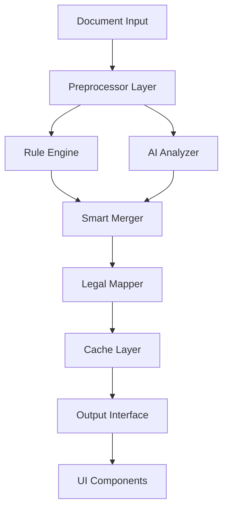

# Design Document

## Overview

The Legal Data Intelligence system is a comprehensive enhancement to our law education platform's data extraction and analysis capabilities. It combines rule-based extraction with AI-powered analysis to intelligently identify, extract, and structure legal information from court documents. This system will significantly improve data accuracy, reduce manual intervention, and provide deeper legal insights through optimized AI prompts and smart caching mechanisms.

## Steering Document Alignment

### Technical Standards (tech.md)
- **Next.js 14 App Router**: All API endpoints will use the app router pattern
- **TypeScript**: Strict typing for all data models and interfaces
- **Zustand State Management**: Integrated with existing case store for state persistence
- **DeepSeek AI Integration**: Following established AI service patterns
- **Error Handling**: Comprehensive fallback mechanisms for AI failures

### Project Structure (structure.md)
- **API Routes**: `/app/api/legal-intelligence/*` for new endpoints
- **Libraries**: `/lib/legal-intelligence/*` for core extraction logic
- **Components**: Enhanced timeline components in `/components/acts/*`
- **Types**: Extended legal data types in `/types/legal-case.ts`
- **Utilities**: Reusable extraction utilities in `/lib/utils/*`

## Code Reuse Analysis

### Existing Components to Leverage
- **`/lib/legal-analysis-engine.ts`**: Core pattern matching and extraction logic
- **`/app/api/legal-analysis/route.ts`**: DeepSeek API integration patterns
- **`/lib/stores/useCaseStore.ts`**: State management for case data
- **`/components/acts/CaseTimelineEnhanced.tsx`**: Timeline visualization components

### Integration Points
- **DeepSeek API**: Extend existing integration with optimized prompts
- **Case Store**: Enhance with new legal element storage
- **Timeline Components**: Integrate smart marking and highlighting
- **Existing Parsers**: Build upon current document parsing logic

## Architecture

The system follows a layered architecture with clear separation of concerns:



### Modular Design Principles
- **Single File Responsibility**: Each extractor handles one legal element type
- **Component Isolation**: Separate extraction, analysis, and mapping logic
- **Service Layer Separation**: Clear boundaries between data, business, and presentation
- **Utility Modularity**: Focused utilities for pattern matching, date parsing, etc.

## Components and Interfaces

### 1. Document Preprocessor
- **Purpose:** Clean and normalize document text for extraction
- **Interfaces:** 
  ```typescript
  preprocessDocument(text: string): ProcessedDocument
  extractMetadata(document: ProcessedDocument): DocumentMetadata
  ```
- **Dependencies:** None
- **Reuses:** Existing text cleaning utilities

### 2. Rule-Based Extractor
- **Purpose:** Extract legal elements using pattern matching
- **Interfaces:**
  ```typescript
  extractDates(text: string): DateElement[]
  extractParties(text: string): Party[]
  extractLegalClauses(text: string): LegalClause[]
  extractAmounts(text: string): Amount[]
  ```
- **Dependencies:** Preprocessor
- **Reuses:** `/lib/legal-analysis-engine.ts` patterns

### 3. AI Prompt Optimizer
- **Purpose:** Generate optimized prompts for DeepSeek API
- **Interfaces:**
  ```typescript
  generateExtractionPrompt(element: ElementType, context: string): string
  generateAnalysisPrompt(data: ExtractedData): string
  formatResponseSchema(element: ElementType): JSONSchema
  ```
- **Dependencies:** None
- **Reuses:** Existing prompt patterns

### 4. Smart Merger
- **Purpose:** Intelligently combine rule-based and AI results
- **Interfaces:**
  ```typescript
  mergeResults(ruleData: ExtractedData, aiData: ExtractedData): MergedData
  resolveConflicts(conflicts: Conflict[]): Resolution[]
  calculateConfidence(data: MergedData): ConfidenceScore
  ```
- **Dependencies:** Rule Extractor, AI Analyzer
- **Reuses:** Conflict resolution patterns

### 5. Legal Provision Mapper
- **Purpose:** Map case types to relevant legal provisions
- **Interfaces:**
  ```typescript
  mapCaseTypeToProvisions(caseType: string): LegalProvision[]
  findRelevantStatutes(facts: string[]): Statute[]
  generateLegalReferences(elements: LegalElement[]): Reference[]
  ```
- **Dependencies:** Legal database
- **Reuses:** Existing legal reference data

### 6. Cache Manager
- **Purpose:** Cache extraction results and AI responses
- **Interfaces:**
  ```typescript
  getCachedResult(key: string): CachedData | null
  setCachedResult(key: string, data: any, ttl?: number): void
  invalidateCache(pattern: string): void
  ```
- **Dependencies:** Storage layer
- **Reuses:** Existing cache utilities

## Data Models

### ExtractedData
```typescript
interface ExtractedData {
  dates: DateElement[]
  parties: Party[]
  amounts: Amount[]
  legalClauses: LegalClause[]
  facts: FactElement[]
  metadata: DocumentMetadata
  confidence: number
  source: 'rule' | 'ai' | 'merged'
}
```

### DateElement
```typescript
interface DateElement {
  date: string
  type: 'filing' | 'incident' | 'judgment' | 'deadline'
  description: string
  importance: 'critical' | 'important' | 'reference'
  relatedParties?: string[]
}
```

### LegalProvision
```typescript
interface LegalProvision {
  code: string
  title: string
  article: string
  relevance: number
  applicability: string[]
  citations: Citation[]
}
```

### AIPromptTemplate
```typescript
interface AIPromptTemplate {
  id: string
  elementType: ElementType
  template: string
  responseSchema: JSONSchema
  examples: Example[]
  version: string
}
```

## Error Handling

### Error Scenarios

1. **AI Service Unavailable**
   - **Handling:** Fall back to rule-based extraction only
   - **User Impact:** Notification about reduced accuracy, results still provided

2. **Invalid Document Format**
   - **Handling:** Attempt text extraction, provide partial results
   - **User Impact:** Warning about incomplete extraction

3. **Parsing Conflicts**
   - **Handling:** Use confidence scoring to select best result
   - **User Impact:** Show confidence level, allow manual verification

4. **Rate Limiting**
   - **Handling:** Queue requests, use cache aggressively
   - **User Impact:** Slight delay with progress indicator

5. **Malformed AI Response**
   - **Handling:** Parse what's possible, fill gaps with rules
   - **User Impact:** Seamless experience with fallback data

## Testing Strategy

### Unit Testing
- Pattern matching accuracy for each element type
- Prompt generation correctness
- Merge logic validation
- Cache hit/miss scenarios

### Integration Testing
- End-to-end extraction pipeline
- AI service integration with fallbacks
- State management updates
- UI component data flow

### End-to-End Testing
- Upload document → View extracted elements
- AI analysis trigger → Display results
- Cache effectiveness across sessions
- Error recovery scenarios

## Performance Considerations

- **Caching Strategy:** 24-hour TTL for AI results, 1-hour for rule-based
- **Batch Processing:** Process multiple elements in single AI call
- **Progressive Loading:** Show rule-based results immediately, enhance with AI
- **Debouncing:** Prevent duplicate API calls for rapid interactions

## Security Considerations

- **Input Sanitization:** Clean all document text before processing
- **API Key Protection:** Server-side only API calls
- **Rate Limiting:** Implement per-user request limits
- **Data Privacy:** No PII stored in cache without encryption