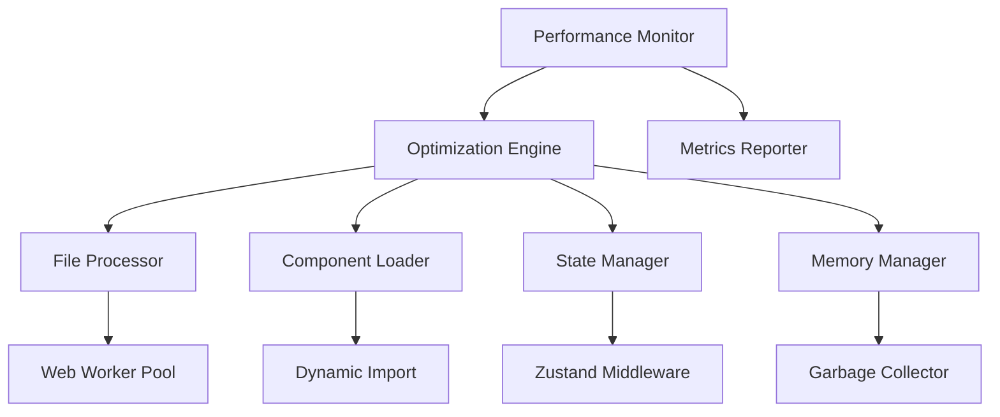

# Design Document

## Overview

本设计文档描述法律教育平台的全面性能优化方案，涵盖文件处理、组件加载、状态管理、测试覆盖和内存管理五个核心领域。通过渐进式优化策略，在不影响现有功能的前提下，显著提升系统响应速度和用户体验。

## Steering Document Alignment

### Technical Standards (tech.md)
- 遵循React 19并发特性和Suspense边界设计
- 采用Next.js 14的App Router优化策略
- 使用TypeScript严格类型检查确保代码质量
- 集成Zustand的shallow comparison优化状态更新

### Project Structure (structure.md)
- 性能优化工具集中在`lib/utils/performance/`目录
- 测试文件遵循`__tests__`目录结构
- 缓存管理统一在`lib/cache/`模块
- 监控工具放置在`lib/monitoring/`

## Code Reuse Analysis

### Existing Components to Leverage
- **useCaseStore**: 扩展现有store添加性能监控hooks
- **FileUploadArea**: 优化文件处理逻辑，添加分块上传
- **CaseTimeline**: 实施虚拟滚动优化长列表渲染
- **Act组件系列**: 应用React.lazy实现按需加载

### Integration Points
- **localStorage**: 增强缓存策略，添加过期机制和容量管理
- **DeepSeek API**: 实施请求缓存和批量处理
- **文件解析库**: 集成Web Worker实现异步解析
- **状态管理**: 优化Zustand中间件，减少不必要的重渲染

## Architecture

采用分层优化架构，从底层基础设施到上层用户界面逐层优化：

### Modular Design Principles
- **Single File Responsibility**: 每个优化模块独立负责特定性能指标
- **Component Isolation**: 性能关键组件独立优化，不影响其他模块
- **Service Layer Separation**: 分离性能监控、优化执行和结果报告
- **Utility Modularity**: 工具函数细粒度拆分，支持tree shaking



## Components and Interfaces

### Performance Monitor
- **Purpose:** 实时监控系统性能指标
- **Interfaces:** 
  ```typescript
  interface PerformanceMonitor {
    startTracking(metric: string): void;
    stopTracking(metric: string): MetricResult;
    getMetrics(): PerformanceMetrics;
  }
  ```
- **Dependencies:** Web Performance API, React DevTools
- **Reuses:** 现有的console日志系统

### File Processing Optimizer
- **Purpose:** 优化大文件处理性能
- **Interfaces:**
  ```typescript
  interface FileProcessor {
    processInChunks(file: File, chunkSize?: number): AsyncIterator<ProcessedChunk>;
    parseWithWorker(content: string): Promise<ParsedDocument>;
    cacheResult(key: string, data: any): void;
  }
  ```
- **Dependencies:** Web Workers, IndexedDB
- **Reuses:** 现有的文件解析库(mammoth, pdf-parse)

### Component Lazy Loader
- **Purpose:** 实现组件按需加载和预加载
- **Interfaces:**
  ```typescript
  interface LazyLoader {
    preload(componentPath: string): void;
    lazyLoad<T>(loader: () => Promise<T>): React.LazyExoticComponent<T>;
    withSuspense<T>(Component: T, fallback?: ReactNode): T;
  }
  ```
- **Dependencies:** React.lazy, Suspense
- **Reuses:** 现有的路由配置

### State Optimization Middleware
- **Purpose:** 优化Zustand状态更新性能
- **Interfaces:**
  ```typescript
  interface StateOptimizer {
    batchUpdates<T>(updates: StateUpdate<T>[]): void;
    debounceUpdate<T>(update: StateUpdate<T>, delay: number): void;
    memoizeSelector<T>(selector: StateSelector<T>): T;
  }
  ```
- **Dependencies:** Zustand, immer
- **Reuses:** 现有的useCaseStore

### Memory Manager
- **Purpose:** 管理内存使用，防止泄漏
- **Interfaces:**
  ```typescript
  interface MemoryManager {
    trackComponent(id: string, cleanup: () => void): void;
    cleanupComponent(id: string): void;
    monitorUsage(): MemoryUsage;
    triggerGC(): void;
  }
  ```
- **Dependencies:** WeakMap, FinalizationRegistry
- **Reuses:** React组件生命周期

## Data Models

### Performance Metrics
```typescript
interface PerformanceMetrics {
  id: string;
  timestamp: number;
  metrics: {
    FCP: number;  // First Contentful Paint
    LCP: number;  // Largest Contentful Paint
    TTI: number;  // Time to Interactive
    FID: number;  // First Input Delay
    CLS: number;  // Cumulative Layout Shift
  };
  customMetrics: Record<string, number>;
}
```

### Cache Entry
```typescript
interface CacheEntry<T> {
  key: string;
  data: T;
  timestamp: number;
  ttl: number;  // Time to live in milliseconds
  size: number;  // Size in bytes
  hitCount: number;
}
```

### File Processing Result
```typescript
interface ProcessingResult {
  id: string;
  fileName: string;
  chunks: ProcessedChunk[];
  totalSize: number;
  processingTime: number;
  status: 'pending' | 'processing' | 'completed' | 'failed';
  error?: Error;
}
```

## Error Handling

### Error Scenarios
1. **File Processing Timeout**
   - **Handling:** 自动切换到分块处理模式，显示进度
   - **User Impact:** 看到进度条，处理继续但速度可能稍慢

2. **Memory Limit Exceeded**
   - **Handling:** 触发垃圾回收，清理缓存，降级到基础模式
   - **User Impact:** 短暂加载提示，功能继续可用

3. **Component Load Failure**
   - **Handling:** 重试3次，失败后显示错误边界组件
   - **User Impact:** 看到友好错误提示和刷新按钮

4. **Cache Corruption**
   - **Handling:** 清除损坏缓存，重新获取数据
   - **User Impact:** 稍长加载时间，功能正常

5. **Worker Thread Crash**
   - **Handling:** 重启worker，任务重新分配
   - **User Impact:** 处理稍有延迟，自动恢复

## Testing Strategy

### Unit Testing
- 测试每个优化模块的独立功能
- Mock外部依赖（Worker, Storage）
- 覆盖边界条件和错误场景
- 性能基准测试

### Integration Testing
- 测试优化模块间的协作
- 验证缓存策略效果
- 测试降级机制
- 端到端性能测试

### End-to-End Testing
- 模拟真实用户场景
- 测试大文件上传处理
- 验证长时间使用的内存稳定性
- 测试网络波动下的表现