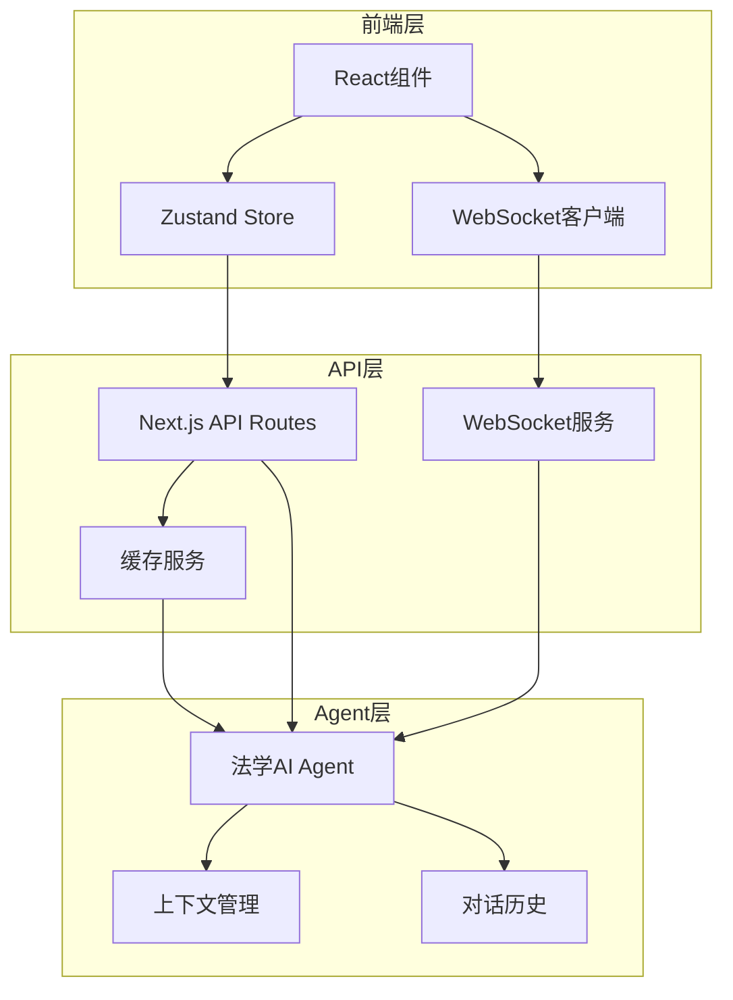

# Design Document - 苏格拉底式问答模块

## Overview

苏格拉底式问答模块采用轻量级Agent架构，在现有Next.js 15 + React 19项目基础上实现。系统核心是一个专门的法学AI Agent，通过WebSocket实现实时课堂互动，配合智能缓存层降低AI调用成本。设计遵循渐进增强原则，确保与现有代码库完全兼容。

## Steering Document Alignment

### Technical Standards (tech.md)
由于项目无steering docs，我们遵循现有代码约定：
- Next.js 15 App Router模式
- React 19 Server Components优先
- Tailwind CSS + shadcn/ui组件库
- TypeScript严格模式
- Zustand状态管理

### Project Structure (structure.md)
保持现有项目结构：
```
/app/api/socratic/         # API路由
/components/acts/          # UI组件
/lib/agents/              # 新增：Agent逻辑
/lib/services/            # 新增：服务层
/lib/stores/              # 状态管理
```

## Code Reuse Analysis

### Existing Components to Leverage
- **useCaseStore**: 复用案例数据管理，扩展socraticState
- **Act5SocraticDiscussion.tsx**: 保留UI框架，重构业务逻辑
- **ErrorBoundary**: 复用错误处理组件
- **storage.ts**: 复用缓存机制
- **/api/socratic/route.ts**: 重构为Agent调用入口

### Integration Points
- **案例数据**: 从useCaseStore获取当前案例上下文
- **UI组件库**: 使用现有的shadcn/ui组件
- **API模式**: 遵循现有的NextResponse模式
- **状态管理**: 扩展现有的Zustand store

## Architecture

采用简化的三层架构，避免过度工程化：



### Modular Design Principles
- **单一职责**: 每个模块专注一个功能领域
- **组件隔离**: UI组件与业务逻辑分离
- **服务层分离**: Agent逻辑独立于API层
- **工具模块化**: 问答处理、缓存、历史管理独立

## Components and Interfaces

### Component 1: SocraticDialogueUI
- **Purpose:** 课堂互动界面，支持问答和实时交互
- **Interfaces:** 
  ```typescript
  interface SocraticDialogueProps {
    caseId: string
    mode: 'classroom' | 'demo'
    onComplete?: () => void
  }
  ```
- **Dependencies:** WebSocket客户端、useSocraticStore
- **Reuses:** 现有的UI组件、Badge、Card、Button

### Component 2: LegalAgentService
- **Purpose:** 法学AI Agent核心服务
- **Interfaces:**
  ```typescript
  interface LegalAgentService {
    generateQuestion(context: DialogueContext): Promise<AgentResponse>
    analyzeAnswer(answer: string, context: DialogueContext): Promise<Analysis>
    getNextLevel(currentLevel: number, performance: Performance): Level
  }
  ```
- **Dependencies:** OpenAI API、缓存服务
- **Reuses:** 无（新组件）

### Component 3: ClassroomManager
- **Purpose:** 管理课堂会话和实时交互
- **Interfaces:**
  ```typescript
  interface ClassroomManager {
    createSession(teacherId?: string): string // 返回6位课堂码
    joinSession(code: string): SessionInfo
    broadcast(sessionId: string, message: Message): void
    handleVote(sessionId: string, voteData: VoteData): void
  }
  ```
- **Dependencies:** WebSocket服务、内存存储
- **Reuses:** 无（新组件）

### Component 4: CacheService
- **Purpose:** 智能缓存管理，降低AI成本
- **Interfaces:**
  ```typescript
  interface CacheService {
    get(key: string): CachedResponse | null
    set(key: string, response: AgentResponse): void
    findSimilar(question: string, threshold: number): CachedResponse[]
    getStats(): CacheStats
  }
  ```
- **Dependencies:** Redis/内存缓存
- **Reuses:** storage.ts的部分逻辑

## Data Models

### DialogueState
```typescript
interface DialogueState {
  sessionId: string           // 课堂会话ID
  caseId: string              // 案例ID
  currentLevel: 1|2|3|4|5    // 当前层级
  messages: Message[]         // 对话历史
  participants: string[]      // 参与者列表
  mode: 'auto' | 'manual'    // 控制模式
  performance: {
    questionCount: number
    correctRate: number
    thinkingTime: number[]
  }
}
```

### Message
```typescript
interface Message {
  id: string
  role: 'student' | 'agent' | 'teacher'
  content: string
  level: number
  timestamp: number
  metadata?: {
    keywords?: string[]       // AI识别的关键概念
    quality?: number         // 回答质量评分
    suggestions?: string[]   // 改进建议
  }
}
```

### AgentContext
```typescript
interface AgentContext {
  case: {
    id: string
    type: string              // 民事/刑事/行政
    facts: string[]          // 案件事实
    disputes: string[]       // 争议焦点
  }
  dialogue: {
    level: number
    history: Message[]
    performance: Performance
  }
  settings: {
    difficulty: 'easy' | 'normal' | 'hard'
    language: 'zh-CN'
    legalSystem: 'chinese'
  }
}
```

### ClassroomSession
```typescript
interface ClassroomSession {
  code: string               // 6位数字码
  createdAt: number
  expiresAt: number         // 6小时后过期
  teacher?: string          // 可选教师ID
  students: Map<string, StudentInfo>
  currentQuestion?: string
  votes?: Map<string, VoteChoice>
}
```

## Error Handling

### Error Scenarios
1. **AI服务不可用**
   - **Handling:** 降级到缓存问答库，提示"AI助手正在思考中，先看看这个问题"
   - **User Impact:** 获得预设高质量问题，体验降级但可用

2. **WebSocket连接断开**
   - **Handling:** 自动重连3次，失败后降级到轮询模式
   - **User Impact:** 短暂延迟后恢复，或切换到3秒轮询

3. **课堂码过期**
   - **Handling:** 提示重新生成课堂码，保存当前进度
   - **User Impact:** 需要重新加入，但学习进度不丢失

4. **并发超限**
   - **Handling:** 队列处理，返回预计等待时间
   - **User Impact:** 看到"排队中，预计等待5秒"

5. **输入内容违规**
   - **Handling:** 前端过滤 + 后端验证，返回友好提示
   - **User Impact:** "请使用专业的法律术语进行讨论"

## Testing Strategy

### Unit Testing
- **Agent逻辑测试**: 问题生成、答案分析、层级判断
- **缓存算法测试**: 相似度匹配、过期清理
- **工具函数测试**: 文本处理、概念提取
- 使用现有的Jest配置

### Integration Testing
- **API端到端测试**: 完整的问答流程
- **WebSocket测试**: 连接、消息、断线重连
- **缓存集成测试**: 命中率、降级处理
- 复用现有的测试框架

### End-to-End Testing
- **完整课堂流程**: 创建→加入→问答→结束
- **多人互动场景**: 并发、投票、举手
- **降级场景测试**: AI不可用时的体验
- 使用Playwright（如已配置）

## Implementation Details

### AI Agent实现策略
```typescript
// 采用简化的Chain模式，避免过度复杂
class LegalSocraticAgent {
  private systemPrompt = `你是苏格拉底，专门进行中国法律教学...`
  
  async generateQuestion(context: AgentContext) {
    // 1. 构建上下文
    const prompt = this.buildPrompt(context)
    
    // 2. 检查缓存
    const cached = await this.cache.findSimilar(prompt)
    if (cached) return cached
    
    // 3. 调用AI（流式响应）
    const response = await this.callAI(prompt, { stream: true })
    
    // 4. 缓存结果
    await this.cache.set(prompt, response)
    
    return response
  }
}
```

### WebSocket通信协议
```typescript
// 消息类型定义
enum MessageType {
  JOIN = 'join',
  LEAVE = 'leave',
  MESSAGE = 'message',
  VOTE = 'vote',
  HAND_RAISE = 'hand_raise',
  TEACHER_CONTROL = 'teacher_control'
}

// 使用Socket.IO for Next.js
// 轻量级实现，不引入复杂的消息队列
```

### 缓存策略
```typescript
// 三级缓存策略
class CacheStrategy {
  // L1: 内存缓存（最近100条）
  private memoryCache = new LRUCache(100)
  
  // L2: localStorage（客户端）
  private localCache = new LocalStorage('socratic')
  
  // L3: Redis/KV存储（如果配置）
  private remoteCache = new RedisCache()
  
  async get(key: string) {
    return this.memoryCache.get(key) 
      || await this.localCache.get(key)
      || await this.remoteCache.get(key)
  }
}
```

## Performance Considerations

### 优化策略
1. **流式响应**: AI回答采用流式输出，提升体感
2. **预加载**: 提前加载下一层级可能的问题
3. **批处理**: 相似问题合并处理
4. **CDN静态资源**: 预设问题库放CDN

### 成本控制
1. **Token优化**: 精简prompt，使用GPT-4o-mini
2. **缓存优先**: 85%相似度即复用
3. **限流保护**: 每课堂100次/小时
4. **降级方案**: 高峰期自动切换预设库

## Security Considerations

1. **输入验证**: 防止prompt注入
2. **会话隔离**: 课堂间数据隔离
3. **临时身份**: 无需真实用户信息
4. **自动清理**: 过期数据定时删除

## Migration Path

### 第一阶段：基础实现（Week 1）
- 重构Act5SocraticDiscussion组件
- 实现基础Agent服务
- 连通前后端

### 第二阶段：实时交互（Week 2）
- 添加WebSocket支持
- 实现课堂管理
- 多人互动功能

### 第三阶段：优化完善（Week 3）
- 智能缓存实现
- 性能优化
- 测试完善