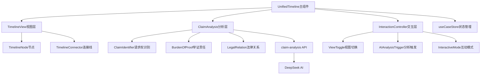

# Design Document

## Overview

本设计将现有的三个时间轴组件（CaseTimelineSimplified、CaseTimelineEnhanced、TimelineAIAnalysis）合并为一个统一的智能时间轴组件UnifiedTimeline，并引入请求权分析法（Anspruchsmethode）作为核心法律分析框架。新组件将提供基础时间轴展示、AI智能分析、请求权标注、法律关系追踪等功能，形成一个完整的法律教学工具。

## Steering Document Alignment

### Technical Standards (tech.md)
- 使用Next.js 15 App Router架构
- 统一使用DeepSeek作为AI服务提供商
- 遵循React 19最佳实践和TypeScript严格类型
- 使用Zustand进行状态管理

### Project Structure (structure.md)
```
components/acts/
  └── UnifiedTimeline/           # 新的统一组件
      ├── index.tsx              # 主组件
      ├── TimelineView.tsx       # 时间轴视图
      ├── ClaimAnalysis.tsx      # 请求权分析
      └── types.ts               # 类型定义

app/api/
  └── claim-analysis/            # 新的API路由
      └── route.ts               # 请求权分析API

lib/
  ├── ai-claim-analyzer.ts      # 请求权分析引擎
  └── legal-provisions-db.ts    # 法条数据库扩展
```

## Code Reuse Analysis

### Existing Components to Leverage
- **TimelineNodeDetail.tsx**: 复用节点详情展示逻辑
- **useCaseStore**: 继续使用现有的状态管理
- **DeepSeek API集成**: 复用lib/ai-legal-agent.ts的API调用逻辑
- **legal-provisions.json**: 扩展现有法条数据库

### Integration Points
- **现有API路由**: 与extract-elements和legal-analysis API协同工作
- **Zustand Store**: 扩展store添加请求权分析相关状态
- **UI组件库**: 继续使用Radix UI和自定义组件

## Architecture

采用分层架构设计，确保关注点分离和模块化：

### Modular Design Principles
- **单一职责**: 每个子组件负责特定功能（时间轴渲染、请求权分析、交互控制）
- **组件隔离**: UI组件与业务逻辑分离
- **服务层分离**: API调用、数据处理、UI渲染三层分离
- **状态集中**: 使用Zustand统一管理复杂状态



## Components and Interfaces

### UnifiedTimeline (主组件)
- **Purpose:** 统一的时间轴展示和分析组件
- **Interfaces:** 
  ```typescript
  interface UnifiedTimelineProps {
    caseData: CaseData
    mode?: 'simple' | 'enhanced' | 'analysis'
    onNodeClick?: (node: TimelineNode) => void
    enableAI?: boolean
  }
  ```
- **Dependencies:** TimelineView, ClaimAnalysis, useCaseStore
- **Reuses:** 现有的时间轴数据结构和展示逻辑

### TimelineView (视图组件)
- **Purpose:** 渲染时间轴UI，包括节点、连接线、标注
- **Interfaces:**
  ```typescript
  interface TimelineViewProps {
    events: TimelineEvent[]
    claimAnnotations?: ClaimAnnotation[]
    viewMode: 'simple' | 'enhanced'
    selectedNodeId?: string
  }
  ```
- **Dependencies:** TimelineNode, TimelineConnector组件
- **Reuses:** CaseTimelineSimplified的渲染逻辑

### ClaimAnalysis (分析组件)
- **Purpose:** 执行和展示请求权分析
- **Interfaces:**
  ```typescript
  interface ClaimAnalysisProps {
    events: TimelineEvent[]
    onAnalysisComplete: (analysis: ClaimAnalysisResult) => void
  }
  ```
- **Dependencies:** claim-analysis API, DeepSeek服务
- **Reuses:** TimelineAIAnalysis的AI调用逻辑

## Data Models

### TimelineEvent (扩展版)
```typescript
interface TimelineEvent {
  id: string
  date: string
  title: string
  description: string
  type: 'filing' | 'evidence' | 'hearing' | 'judgment' | 'execution'
  importance: 'critical' | 'important' | 'reference'
  
  // 新增请求权相关字段
  claims?: {
    basis: string[]           // 请求权基础（法条）
    elements: ClaimElement[]  // 构成要件
    fulfilled: boolean        // 是否满足
  }
  legalRelation?: {
    type: string             // 法律关系类型
    parties: string[]        // 当事方
    change: 'created' | 'modified' | 'terminated'
  }
  burdenOfProof?: {
    party: string            // 举证责任方
    standard: string         // 证明标准
    evidence: string[]       // 相关证据
  }
}
```

### ClaimAnalysisResult
```typescript
interface ClaimAnalysisResult {
  id: string
  timestamp: string
  claims: {
    primary: ClaimStructure[]      // 主要请求权
    alternative: ClaimStructure[]  // 备选请求权
    defense: DefenseStructure[]    // 抗辩事由
  }
  timeline: {
    keyPoints: TimelineKeyPoint[]  // 关键时间点
    limitations: LimitationPeriod[] // 时效期间
  }
  strategy: {
    recommendations: string[]       // 策略建议
    risks: string[]                // 风险提示
  }
}
```

### ClaimStructure
```typescript
interface ClaimStructure {
  basis: string                    // 请求权基础（法条）
  elements: {
    name: string                   // 要件名称
    description: string            // 要件说明
    satisfied: boolean             // 是否满足
    evidence: string[]             // 支撑证据
  }[]
  conclusion: 'established' | 'partial' | 'failed'
}
```

## Error Handling

### Error Scenarios

1. **AI分析失败**
   - **Handling:** 降级到基础时间轴展示，显示友好错误提示
   - **User Impact:** 用户仍可查看基础时间轴，但无法使用AI分析功能

2. **API限流**
   - **Handling:** 实施请求队列和重试机制，使用缓存避免重复请求
   - **User Impact:** 显示"分析中，请稍候"，延迟但不中断服务

3. **数据解析错误**
   - **Handling:** 使用默认值和容错处理，记录错误日志
   - **User Impact:** 部分功能可能不完整，但主要功能正常

4. **网络连接问题**
   - **Handling:** 提供离线模式，使用本地缓存数据
   - **User Impact:** 基础功能可用，AI功能暂时不可用

## Testing Strategy

### Unit Testing
- **组件测试**: 使用@testing-library/react测试各子组件
- **关键功能**: 
  - 时间轴事件排序算法
  - 请求权识别逻辑
  - 日期处理和格式化

### Integration Testing
- **API集成**: 测试与DeepSeek API的交互
- **状态管理**: 测试Zustand store的状态更新
- **关键流程**:
  - 文档上传→解析→时间轴生成
  - AI分析触发→结果展示
  - 视图切换和交互响应

### End-to-End Testing
- **用户场景**:
  - 上传判决书并查看时间轴
  - 触发AI分析并查看请求权标注
  - 切换不同视图模式
  - 使用互动学习模式