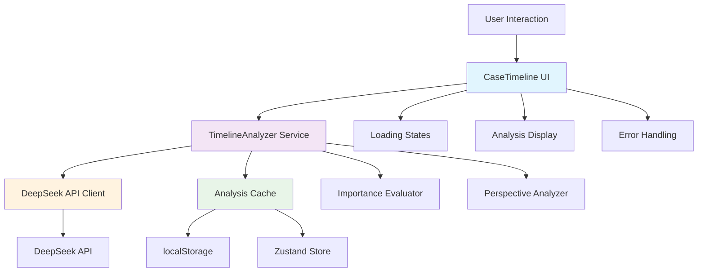

# Design Document

## Overview

时间轴智能分析功能通过集成DeepSeek AI API，为法律教育平台的交互式案件时间轴提供深度的法学分析能力。该功能采用实时API调用方案，结合智能缓存策略，为每个时间节点提供个性化、多视角的专业法学解读。

核心架构基于模块化设计原则，包含AI分析服务层、缓存管理层、多视角分析引擎和响应式UI组件，确保高性能和良好的用户体验。

## Steering Document Alignment

### Technical Standards (tech.md)
- 遵循Next.js 15.2.4 + React 19 + TypeScript技术栈
- 使用Zustand进行状态管理
- 采用TailwindCSS + Radix UI组件库
- 遵循现有的API路由模式和错误处理规范

### Project Structure (structure.md)  
- AI服务放置在`/lib/ai-timeline-analyzer.ts`
- 缓存工具位于`/lib/utils/analysis-cache.ts`
- 类型定义扩展`/types/legal-case.ts`
- UI组件增强现有`/components/acts/CaseTimeline.tsx`

## Code Reuse Analysis

### Existing Components to Leverage
- **useCaseStore**: 扩展现有状态管理，添加分析结果缓存
- **ai-legal-agent-deepseek.ts**: 复用DeepSeek API配置和基础调用逻辑
- **CaseTimeline组件**: 在现有时间轴基础上增强交互和分析展示
- **Progress组件**: 复用现有进度条组件显示分析加载状态

### Integration Points
- **DeepSeek API**: 集成现有的AI服务配置，复用认证和错误处理机制
- **案件数据流**: 基于现有的`caseData.threeElements.facts.timeline`数据结构
- **缓存存储**: 集成浏览器localStorage和Zustand持久化机制
- **错误监控**: 复用现有的错误边界和用户反馈机制

## Architecture

采用分层架构模式，确保关注点分离和高度模块化：

### Modular Design Principles
- **Single File Responsibility**: AI服务、缓存管理、UI组件各自独立
- **Component Isolation**: 分析展示、加载状态、错误处理独立组件
- **Service Layer Separation**: 数据获取、业务逻辑、展示层清晰分离
- **Utility Modularity**: 重要性评估、视角分析、缓存策略独立工具



## Components and Interfaces

### TimelineAnalyzer Service
- **Purpose:** 核心AI分析服务，协调API调用、缓存管理和结果处理
- **Interfaces:** 
  - `analyzeTimelineEvent(event, perspective, caseContext): Promise<TimelineAnalysis>`
  - `evaluateImportance(event, caseContext): Promise<ImportanceScore>`
  - `generatePerspectiveAnalysis(event, perspective, caseContext): Promise<PerspectiveAnalysis>`
- **Dependencies:** DeepSeek API Client, Analysis Cache, Case Data Store
- **Reuses:** 现有DeepSeek配置、错误处理机制

### Analysis Cache Manager
- **Purpose:** 智能缓存管理，优化API调用频率和响应性能
- **Interfaces:**
  - `getCachedAnalysis(eventId, perspective): TimelineAnalysis | null`
  - `setCachedAnalysis(eventId, perspective, analysis): void`
  - `invalidateCache(eventId?): void`
  - `getCacheStats(): CacheStatistics`
- **Dependencies:** localStorage, Zustand持久化
- **Reuses:** 现有存储工具和状态管理模式

### Enhanced CaseTimeline Component
- **Purpose:** 增强现有时间轴组件，集成智能分析展示和交互
- **Interfaces:**
  - `props: { enableIntelligentAnalysis: boolean, perspective: ViewPerspective }`
  - `state: { analysisLoading: Map<string, boolean>, analysisResults: Map<string, TimelineAnalysis> }`
- **Dependencies:** TimelineAnalyzer Service, 现有时间轴逻辑
- **Reuses:** 现有CaseTimeline组件、Progress组件、Badge组件

### Perspective Analysis Engine  
- **Purpose:** 多视角分析逻辑，生成针对性的法学解读
- **Interfaces:**
  - `generatePlaintiffAnalysis(event, caseContext): PerspectiveAnalysis`
  - `generateDefendantAnalysis(event, caseContext): PerspectiveAnalysis`
  - `generateJudgeAnalysis(event, caseContext): PerspectiveAnalysis`
  - `generateNeutralAnalysis(event, caseContext): PerspectiveAnalysis`
- **Dependencies:** DeepSeek API, 法学知识模板
- **Reuses:** 现有AI提示词模板和法学分析框架

## Data Models

### TimelineAnalysis
```typescript
interface TimelineAnalysis {
  eventId: string
  perspective: 'neutral' | 'plaintiff' | 'defendant' | 'judge'
  importance: ImportanceScore
  legalAnalysis: LegalAnalysis
  generatedAt: string
  cacheExpiry: string
  apiVersion: string
}
```

### ImportanceScore
```typescript
interface ImportanceScore {
  score: number // 1-100
  level: 'critical' | 'high' | 'medium' | 'low' 
  reasoning: string
  legalSignificance: string[]
  impactFactors: {
    proceduralImpact: number
    substantiveImpact: number  
    evidenceImpact: number
    strategicImpact: number
  }
}
```

### LegalAnalysis
```typescript
interface LegalAnalysis {
  factualAnalysis: string
  legalPrinciples: string[]
  jurisprudence: string
  evidenceRequirement: string
  riskAssessment: string
  strategicAdvice: string
  applicableLaws: string[]
  precedents: string[]
  keyTerms: Array<{ term: string, definition: string }>
}
```

### PerspectiveAnalysis
```typescript
interface PerspectiveAnalysis extends LegalAnalysis {
  favorablePoints?: string[] // 原告视角
  concerns?: string[] // 原告视角
  defensiveStrategy?: string[] // 被告视角  
  counterArguments?: string[] // 被告视角
  keyFocus?: string[] // 法官视角
  precedents?: string[] // 法官视角
  teachingPoints?: string[] // 教学模式
}
```

### AnalysisCache
```typescript
interface AnalysisCache {
  analyses: Map<string, TimelineAnalysis>
  statistics: {
    hitRate: number
    totalRequests: number
    cacheSize: number
    lastCleanup: string
  }
  config: {
    maxAge: number // 24小时
    maxSize: number // 最大缓存条目
    compressionEnabled: boolean
  }
}
```

## Error Handling

### Error Scenarios
1. **DeepSeek API调用失败**
   - **Handling:** 3次重试 → 降级到基础模板分析 → 缓存错误状态
   - **User Impact:** 显示"使用基础分析模式"提示，分析内容标记为简化版

2. **API响应超时（>8秒）**
   - **Handling:** 取消请求 → 显示加载失败 → 提供手动重试选项
   - **User Impact:** "分析超时，请稍后重试"提示，保留基本事件信息

3. **网络连接中断**
   - **Handling:** 检测网络状态 → 使用缓存内容 → 后台自动重试
   - **User Impact:** 显示"离线模式"标识，使用历史分析结果

4. **缓存数据损坏**
   - **Handling:** 检测数据完整性 → 清理无效缓存 → 重新请求分析
   - **User Impact:** 短暂加载延迟，用户无感知修复

5. **AI返回内容不合规**
   - **Handling:** 内容过滤 → 使用预设模板替换 → 记录异常日志
   - **User Impact:** 显示标准化法学分析内容，确保专业性

## Testing Strategy

### Unit Testing
- **TimelineAnalyzer Service**: 测试API调用、错误处理、重试逻辑
- **Analysis Cache Manager**: 测试缓存命中、过期清理、存储同步
- **Importance Evaluator**: 测试评分算法、边界值处理
- **Perspective Analyzer**: 测试多视角内容生成、模板应用

### Integration Testing
- **API集成流程**: 完整的分析请求→响应→缓存→展示流程
- **缓存同步机制**: 跨组件的缓存状态同步和失效处理  
- **错误恢复流程**: API失败→降级→恢复的完整链路
- **视角切换流程**: 视角变更→缓存查询→内容更新→UI刷新

### End-to-End Testing
- **用户分析体验**: 点击节点→加载状态→分析展示→内容交互
- **教学模式流程**: 启用教学模式→逐步展示→进度跟踪→完成确认
- **性能边界测试**: 大量并发分析请求、网络异常场景、缓存容量边界
- **跨浏览器兼容**: Chrome/Firefox/Safari的功能完整性测试