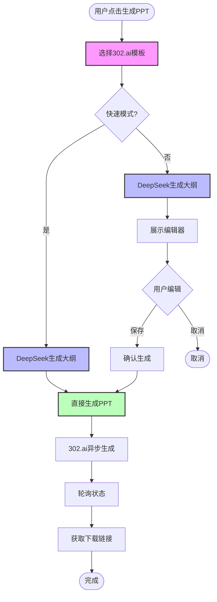

# PPT生成组件优化方案

## 🎯 优化目标

1. **提升用户体验** - 更流畅的交互，更直观的编辑
2. **增强功能** - 支持模板选择、拖拽排序、实时预览
3. **优化性能** - 减少不必要的重渲染

---

## 📋 改进清单

### 1. 新增模板选择器组件

```typescript
// components/ppt/PptTemplateSelector.tsx

interface Template302 {
  id: string;
  name: string;
  preview: string;  // 预览图URL
  style: 'formal' | 'modern' | 'academic';
  description: string;
}

// 302.ai官方模板列表（需要从API获取）
const OFFICIAL_TEMPLATES: Template302[] = [
  {
    id: 'template_001',
    name: '商务正式',
    preview: 'https://...',
    style: 'formal',
    description: '适合教育局申报、正式汇报'
  },
  {
    id: 'template_002',
    name: '现代简约',
    preview: 'https://...',
    style: 'modern',
    description: '适合教师培训、轻松分享'
  },
  // ...更多模板
];
```

**集成位置**：在`PptGeneratorPanel`的第一步，选择模板后再生成大纲

```typescript
// 用户流程改进
Step 1: 选择PPT模板 (新增)
   ↓
Step 2: AI生成大纲
   ↓
Step 3: 编辑大纲
   ↓
Step 4: 生成PPT
```

---

### 2. 优化大纲编辑器

#### 2.1 添加拖拽排序（使用 @dnd-kit）

```typescript
import { DndContext, closestCenter, DragEndEvent } from '@dnd-kit/core';
import { SortableContext, verticalListSortingStrategy, useSortable } from '@dnd-kit/sortable';

// 可拖拽的幻灯片卡片
function SortableSlideCard({ slide, index }: Props) {
  const { attributes, listeners, setNodeRef, transform, transition } = useSortable({
    id: `slide-${index}`
  });

  return (
    <Card ref={setNodeRef} style={{ transform, transition }} {...attributes}>
      {/* 拖拽手柄 */}
      <div {...listeners} className="cursor-move">
        <GripVertical className="w-5 h-5 text-gray-400" />
      </div>
      {/* 原有内容 */}
    </Card>
  );
}
```

#### 2.2 内联编辑（去掉编辑/完成切换）

```typescript
// 改进：contentEditable直接编辑
<div
  contentEditable
  suppressContentEditableWarning
  onBlur={(e) => updateSlide(index, 'content', e.currentTarget.textContent || '')}
  className="min-h-[100px] p-3 rounded border focus:ring-2 focus:ring-blue-500"
>
  {slide.content}
</div>
```

#### 2.3 实时字数统计

```typescript
<div className="text-xs text-gray-500">
  {slide.content.length} 字 • 预计阅读 {Math.ceil(slide.content.length / 300)} 秒
</div>
```

---

### 3. 新增实时预览功能

```typescript
// components/ppt/PptPreview.tsx

export function PptPreview({ outline }: { outline: PptOutline }) {
  return (
    <div className="space-y-4">
      {outline.slides.map((slide, index) => (
        <div key={index} className="aspect-video bg-gradient-to-br from-blue-500 to-purple-600 rounded-lg p-8 text-white">
          {/* 模拟PPT页面 */}
          <h2 className="text-3xl font-bold mb-4">{slide.title}</h2>
          <div className="text-lg whitespace-pre-line">{slide.content}</div>
          <div className="absolute bottom-4 right-4 text-sm opacity-70">
            {index + 1} / {outline.slides.length}
          </div>
        </div>
      ))}
    </div>
  );
}
```

**集成**：在编辑器旁边显示实时预览

```typescript
<div className="grid grid-cols-2 gap-6">
  <div className="space-y-4">
    <h3>编辑大纲</h3>
    <PptOutlineEditor ... />
  </div>
  <div className="sticky top-4">
    <h3>实时预览</h3>
    <PptPreview outline={editedOutline} />
  </div>
</div>
```

---

### 4. 改进进度指示器

#### 当前问题
```typescript
// 进度消息不够详细
"正在生成PPT..." // 太模糊
```

#### 改进方案
```typescript
// 更详细的进度消息
interface DetailedProgress {
  stage: 'outline' | 'content' | 'rendering' | 'completed';
  progress: number;
  message: string;
  details?: {
    currentPage?: number;
    totalPages?: number;
    estimatedRemaining?: number;  // 预计剩余秒数
  };
}

// UI展示
<div>
  <p className="text-lg font-medium">{progress.message}</p>
  {progress.details && (
    <p className="text-sm text-gray-600">
      正在处理第 {progress.details.currentPage}/{progress.details.totalPages} 页
      • 预计还需 {progress.details.estimatedRemaining} 秒
    </p>
  )}
</div>
```

---

## 🎨 302.ai模板支持

### 问题2：是否可以使用302.ai的模板？

**✅ 答案：可以！代码已经支持，但UI缺失**

#### 当前实现
```typescript
// src/domains/teaching-acts/services/PptGeneratorService.ts:344
const requestBody = {
  outlineMarkdown: outlineMarkdown,
  stream: true,
  asyncGenPptx: true,
  lang: options.language || 'zh',
  templateId: options.templateId,  // 🔑 这里可以传模板ID
  prompt: this.buildCustomPrompt(options)
};
```

#### 问题
```typescript
// 当前调用时没有传templateId
const options: PptGenerationOptions = {
  template: 'education-bureau',
  language: 'zh',
  length: 'medium',
  templateId: undefined  // ❌ 没有传，使用随机模板
};
```

#### 解决方案

**Step 1: 获取302.ai可用模板列表**

```bash
# 需要调用302.ai API获取模板列表
GET https://api.302.ai/302/ppt/templates
Authorization: Bearer sk-302ai-xxx
```

**Step 2: 创建模板选择器UI**

```typescript
// components/ppt/TemplateSelector.tsx

import { useState, useEffect } from 'react';

export function TemplateSelector({ onSelect }: Props) {
  const [templates, setTemplates] = useState<Template302[]>([]);
  const [selectedId, setSelectedId] = useState<string | undefined>();

  useEffect(() => {
    // 获取模板列表
    fetchTemplates();
  }, []);

  async function fetchTemplates() {
    try {
      const apiKey = process.env.NEXT_PUBLIC_AI_302_API_KEY;
      const response = await fetch('https://api.302.ai/302/ppt/templates', {
        headers: { 'Authorization': `Bearer ${apiKey}` }
      });
      const data = await response.json();
      setTemplates(data.templates || []);
    } catch (error) {
      console.error('获取模板列表失败:', error);
    }
  }

  return (
    <div className="grid grid-cols-3 gap-4">
      {/* 不选模板选项 */}
      <Card
        className={`cursor-pointer ${!selectedId ? 'ring-2 ring-blue-500' : ''}`}
        onClick={() => {
          setSelectedId(undefined);
          onSelect(undefined);
        }}
      >
        <CardContent className="text-center p-6">
          <Shuffle className="w-12 h-12 mx-auto mb-2 text-gray-400" />
          <h3 className="font-medium">随机模板</h3>
          <p className="text-xs text-gray-500">由302.ai自动选择</p>
        </CardContent>
      </Card>

      {/* 模板列表 */}
      {templates.map((template) => (
        <Card
          key={template.id}
          className={`cursor-pointer hover:shadow-lg transition-shadow ${
            selectedId === template.id ? 'ring-2 ring-blue-500' : ''
          }`}
          onClick={() => {
            setSelectedId(template.id);
            onSelect(template.id);
          }}
        >
          <CardContent className="p-4">
            
            <h3 className="font-medium">{template.name}</h3>
            <p className="text-xs text-gray-600">{template.description}</p>
            <Badge className="mt-2">{template.style}</Badge>
          </CardContent>
        </Card>
      ))}
    </div>
  );
}
```

**Step 3: 集成到PptGeneratorPanel**

```typescript
// components/ppt/PptGeneratorPanel.tsx

export function PptGeneratorPanel() {
  const [selectedTemplateId, setSelectedTemplateId] = useState<string | undefined>();

  // 修改生成流程
  const handleGenerateOutline = async () => {
    const options: PptGenerationOptions = {
      template: 'education-bureau',
      language: 'zh',
      length: 'medium',
      templateId: selectedTemplateId,  // ✅ 传入用户选择的模板ID
      onProgress: (prog) => setProgress(prog)
    };

    const outline = await service.generateOutlineOnly(options);
    setOutline(outline);
  };

  return (
    <Card>
      {stage === 'idle' && (
        <>
          <CardHeader>
            <CardTitle>选择PPT模板</CardTitle>
          </CardHeader>
          <CardContent>
            <TemplateSelector onSelect={setSelectedTemplateId} />
            <Button onClick={handleGenerateOutline} className="mt-4">
              开始生成
            </Button>
          </CardContent>
        </>
      )}
      {/* ...其他阶段 */}
    </Card>
  );
}
```

---

## 🤖 问题3：DeepSeek的使用情况

**✅ 答案：是的，目前仍在使用DeepSeek生成大纲**

### 工作流程确认

```typescript
// 阶段2：AI生成大纲（5-8秒）
private async generateOutline(data, options) {
  // 🔑 这里调用DeepSeek
  const result = await callUnifiedAI(systemPrompt, userPrompt, {
    temperature: 0.5,
    maxTokens: 3000,
    responseFormat: 'json'
  });

  return JSON.parse(result.content);  // 返回JSON格式的PPT大纲
}
```

### 为什么需要DeepSeek？

| 步骤 | 服务 | 作用 | 能否去掉？ |
|------|------|------|----------|
| 1. 生成大纲 | **DeepSeek** | 分析四幕教学数据，生成结构化大纲 | ❌ **不建议** |
| 2. 编辑大纲 | 用户 | 预览和调整 | ✅ 可跳过 |
| 3. 渲染PPT | 302.ai | 生成精美PPT文件 | ❌ 必需 |

### 为什么不建议去掉DeepSeek？

#### 方案对比

**方案A：DeepSeek + 302.ai（当前方案）**
```
优势：
✅ DeepSeek深度理解四幕教学数据
✅ 大纲结构化，用户可编辑
✅ 内容质量高，针对性强
✅ 成本低（¥0.005 + ¥0.07 = ¥0.075）

劣势：
⚠️ 流程多一步（但用户可编辑是价值）
⚠️ 总耗时增加5-8秒
```

**方案B：仅用302.ai**
```
优势：
✅ 流程简化
✅ 耗时减少

劣势：
❌ 302.ai不了解四幕教学数据结构
❌ 需要手动整理数据为Markdown
❌ 无法自定义大纲（失去控制权）
❌ 内容质量可能下降
```

### 推荐优化方案

**保留DeepSeek，但优化体验**：

```typescript
// 新增"快速模式"选项

interface PptGenerationOptions {
  template: PptTemplate;
  quickMode?: boolean;  // 🆕 快速模式（跳过编辑）
  templateId?: string;
}

async generatePPT(options: PptGenerationOptions) {
  // 1. 生成大纲
  const outline = await this.generateOutline(data, options);

  // 2. 快速模式 - 跳过编辑，直接生成
  if (options.quickMode) {
    return await this.generateWithAsyncStream(outline, options);
  }

  // 3. 正常模式 - 展示编辑器
  return outline;  // UI层处理编辑
}
```

**UI层的选择**：

```tsx
<div className="flex items-center gap-4 mb-4">
  <label>
    <input type="checkbox" checked={quickMode} onChange={...} />
    快速生成（跳过大纲编辑）
  </label>
</div>
```

---

## 📊 完整优化后的流程



---

## 🚀 实施优先级

### P0 - 立即实施（1-2天）
- [ ] 添加302.ai模板选择器
- [ ] 传递templateId到API调用
- [ ] 添加"快速模式"跳过编辑选项

### P1 - 短期优化（1周内）
- [ ] 优化PptOutlineEditor UI
- [ ] 添加拖拽排序功能（@dnd-kit）
- [ ] 改进进度指示器（更详细的消息）

### P2 - 中期优化（2-4周）
- [ ] 添加实时预览功能
- [ ] 内联编辑体验优化
- [ ] 添加生成历史记录

---

## 📝 代码改动清单

1. **新建文件**：
   - `components/ppt/TemplateSelector.tsx`
   - `components/ppt/PptPreview.tsx`

2. **修改文件**：
   - `components/ppt/PptGeneratorPanel.tsx` - 集成模板选择器
   - `components/ppt/PptOutlineEditor.tsx` - 优化UI和交互
   - `src/domains/teaching-acts/services/PptGeneratorService.ts` - 支持快速模式

3. **API调用**：
   - 需要调用 `GET /302/ppt/templates` 获取模板列表

---

## ✅ 验收标准

### 功能完整性
- [ ] 用户可以选择302.ai官方模板
- [ ] 支持快速模式（跳过编辑）
- [ ] 大纲编辑器支持拖拽排序
- [ ] 进度指示器显示详细信息

### 用户体验
- [ ] 模板选择界面美观易用
- [ ] 编辑器交互流畅
- [ ] 进度反馈清晰准确
- [ ] 总耗时在可接受范围（< 40秒）

### 技术指标
- [ ] DeepSeek调用成功率 > 99%
- [ ] 302.ai调用成功率 > 95%
- [ ] 前端渲染性能良好
- [ ] 无内存泄漏

---

**文档版本**: v1.0
**创建日期**: 2025-01-14
**维护者**: Claude Code
