# 法学AI教学系统 - 数据流转架构图

## 📊 系统概览

法学AI教学系统基于"四幕教学法"，数据在各个环节之间流转，最终生成完整的学习报告。

## 🔄 完整数据流转图

```mermaid
graph TB
    Start([用户开始]) --> Act1[第一幕: 案例导入]

    subgraph Act1_Process["第一幕处理流程"]
        A1_Upload[上传判决书<br/>Word/PDF] --> A1_API[API: /legal-intelligence/extract]
        A1_API --> A1_Service[JudgmentExtractionService]
        A1_Service --> A1_Extract[提取三要素<br/>事实+证据+推理]
        A1_Extract --> A1_Store[(useTeachingStore<br/>uploadData)]
    end

    Act1 --> Act1_Process
    A1_Store --> Act2[第二幕: 深度分析]

    subgraph Act2_Process["第二幕处理流程"]
        A2_Read[(读取uploadData)] --> A2_Analysis[深度分析服务]
        A2_Analysis --> A2_Story[生成AI叙事故事]
        A2_Story --> A2_Timeline[时间轴分析]
        A2_Timeline --> A2_Store[(useTeachingStore<br/>analysisData)]
    end

    Act2 --> Act2_Process
    A2_Store --> Act3[第三幕: 苏格拉底讨论]

    subgraph Act3_Process["第三幕处理流程"]
        A3_Init[初始化对话] --> A3_User[用户提问]
        A3_User --> A3_API[API: /socratic]
        A3_API --> A3_Stream[SSE流式响应]
        A3_Stream --> A3_DialogueStore[(useSocraticDialogueStore<br/>messages)]
        A3_DialogueStore --> A3_Bridge[数据桥接]
        A3_Bridge --> A3_TeachingStore[(useTeachingStore<br/>socraticData)]
        A3_User --> A3_User
    end

    Act3 --> Act3_Process
    A3_TeachingStore --> Act4[第四幕: 总结提升]

    subgraph Act4_Process["第四幕处理流程"]
        A4_Collect[收集前三幕数据] --> A4_Prepare{准备数据包}
        A4_Prepare --> A4_Upload_Data[uploadData:<br/>案例要素]
        A4_Prepare --> A4_Analysis_Data[analysisData:<br/>深度分析结果]
        A4_Prepare --> A4_Socratic_Data[socraticData:<br/>讨论记录]

        A4_Upload_Data --> A4_API
        A4_Analysis_Data --> A4_API
        A4_Socratic_Data --> A4_API

        A4_API[API: /teaching-acts/summary] --> A4_Service[CaseSummaryService]
        A4_Service --> A4_Generate[生成学习报告]
        A4_Generate --> A4_Report[(CaseLearningReport)]
        A4_Report --> A4_Store[(useTeachingStore<br/>summaryData)]
    end

    Act4 --> Act4_Process
    A4_Store --> End([完成学习<br/>可下载报告])

    style Start fill:#e1f5e1
    style End fill:#ffe1e1
    style Act1 fill:#bbdefb
    style Act2 fill:#c8e6c9
    style Act3 fill:#fff9c4
    style Act4 fill:#ffccbc
```



## 📦 核心数据结构

### 1. useTeachingStore（主状态管理器）

```typescript
interface TeachingState {
  // 当前会话
  currentSession: TeachingSession | null;
  currentAct: ActType; // 'upload' | 'analysis' | 'socratic' | 'summary'

  // 第一幕数据
  uploadData: {
    extractedElements: {
      basicInfo: {...},
      threeElements: {
        facts: [...],      // 事实要素
        evidence: [...],   // 证据要素
        reasoning: [...]   // 推理要素
      }
    },
    confidence: number
  };

  // 第二幕数据
  analysisData: {
    result: DeepAnalysisResult,
    isAnalyzing: boolean
  };

  // 第三幕数据（桥接）
  socraticData: {
    level: 1 | 2 | 3,
    completedNodes: Set<string>
  };

  // 第四幕数据
  summaryData: {
    caseLearningReport: CaseLearningReport,
    isGenerating: boolean
  };
}
```

### 2. useSocraticDialogueStore（对话状态管理）

```typescript
interface DialogueState {
  messages: Message[];              // 对话消息列表
  currentLevel: DialogueLevel;      // beginner | intermediate | advanced
  isGenerating: boolean;
  lastResponse: SocraticResponse | null;
}
```

## 🔗 数据桥接机制

### 第三幕 → 主Store 桥接

在 `useSocraticDialogueStore.addMessage` 中：

```typescript
// 自动同步对话层级到主Store
import('@/src/domains/teaching-acts/stores/useTeachingStore').then(({ useTeachingStore }) => {
  const levelMap = { beginner: 1, intermediate: 2, advanced: 3 };
  const numericLevel = levelMap[state.currentLevel];
  teachingStore.progressSocraticLevel();
});
```

### 第四幕数据聚合

在 `ActFour.generateReport` 中：

```typescript
const requestData = {
  uploadData: store.uploadData,           // 第一幕
  analysisData: store.analysisData,       // 第二幕
  socraticData: {
    level: store.socraticData.level,      // 第三幕
    completedNodes: Array.from(store.socraticData.completedNodes)
  }
};
```

## 🚀 关键API端点

| API路由 | 方法 | 职责 | 输入 | 输出 |
|---------|------|------|------|------|
| `/api/legal-intelligence/extract` | POST | 提取判决书三要素 | `{ text: string }` | `{ basicInfo, threeElements, metadata }` |
| `/api/socratic` | POST | 苏格拉底对话 | `{ userMessage, level, streaming: true }` | SSE流式响应 |
| `/api/teaching-acts/summary` | POST | 生成学习报告 | `{ uploadData, analysisData, socraticData }` | `CaseLearningReport` |

## 📍 数据持久化策略

### Zustand Persist 配置

```typescript
persist(
  immer((set, get) => ({...})),
  {
    name: 'teaching-store',
    partialize: (state) => ({
      // 持久化核心数据
      uploadData: state.uploadData,
      analysisData: { result: state.analysisData.result },
      socraticData: {
        level: state.socraticData.level,
        completedNodes: Array.from(state.socraticData.completedNodes)
      },
      // 不持久化 loading 状态
      // 不持久化 storyChapters（防止缓存问题）
    })
  }
)
```

## 🎯 设计亮点

### 1. 前置条件检查

```typescript
canAdvanceToAct(act: ActType) {
  const prerequisites = {
    upload: [],
    analysis: ['upload'],
    socratic: ['upload', 'analysis'],
    summary: ['upload', 'analysis', 'socratic']
  };
  return prerequisites[act].every(prereq => completedActs.includes(prereq));
}
```

### 2. 流式响应优化

第三幕使用SSE（Server-Sent Events）实现流式输出：
- 减少用户等待时间
- 实时显示AI思考过程
- 更好的用户体验

### 3. 数据隔离与桥接

- **useSocraticDialogueStore**：专注对话逻辑
- **useTeachingStore**：全局教学状态
- 通过动态导入实现单向数据桥接

## 🔧 优化建议

### 当前架构的优势

✅ **清晰的状态管理**：各个幕的数据独立管理
✅ **数据持久化**：防止页面刷新丢失进度
✅ **流式响应**：提升用户体验
✅ **前置条件控制**：保证学习流程完整性

### 潜在改进空间

🔄 **数据桥接简化**
- 考虑使用 Zustand 的 `subscribe` 机制替代动态导入
- 统一数据流向，避免隐式依赖

🚀 **性能优化**
- 第四幕可以提前预加载数据
- 考虑增量式报告生成

📊 **数据校验**
- 在各个幕转换时增加数据完整性校验
- 提供友好的错误提示和恢复机制

## 📈 监控与调试

### 开发工具

1. **Redux DevTools**：Zustand 支持
2. **Console日志**：关键数据流节点都有日志
3. **React DevTools**：查看组件状态

### 关键调试点

```typescript
// ActFour.tsx:50
console.log('📤 [ActFour] 发送Store数据到API:', {
  uploadData存在: !!requestData.uploadData.extractedElements,
  analysisData存在: !!requestData.analysisData.result,
  socraticLevel: requestData.socraticData.level
});

// route.ts:16
console.log('📥 [API] 接收到客户端Store数据:', {...});
```

## 🎓 总结

本系统采用**渐进式数据流转架构**：
1. 数据从简单到复杂逐步积累
2. 每个幕都可以独立运行和测试
3. 最终在第四幕汇总所有学习成果
4. 清晰的状态管理和持久化策略

这种设计既保证了教学流程的系统性，又提供了足够的灵活性和可扩展性。
