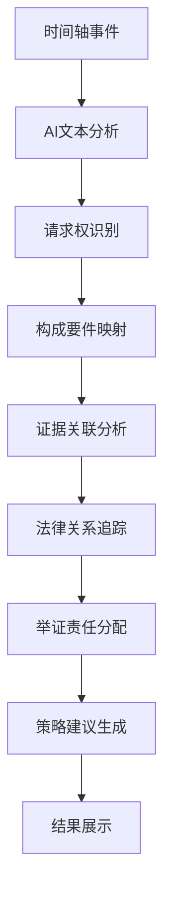

# 时间轴请求权分析功能使用指南

## 功能概述

时间轴请求权分析是本法律教育平台的核心功能，基于德国法学的"请求权分析法"（Anspruchsmethode），将案件事实发展与法律分析深度融合。该功能通过AI智能分析，在时间轴的每个关键节点标注请求权基础、法律关系变化和举证责任分配，帮助法学学生从"事实认定"到"法律适用"建立完整的法律思维。

### 核心价值

- **教育创新**：将抽象的请求权理论可视化，降低学习门槛
- **实践导向**：培养学生的实务思维，而非单纯理论学习  
- **AI赋能**：利用DeepSeek API提供专业的请求权分析建议
- **差异化竞争**：国内首个系统化的请求权分析教学工具

## 请求权分析法简介

### 什么是请求权分析法

请求权分析法（Anspruchsmethode）是德国民法学的重要方法论，通过系统性检验请求权的构成要件来解决法律问题。该方法将复杂的法律关系分解为：

1. **请求权基础**：确定可能的法律依据（如合同、侵权、不当得利等）
2. **构成要件**：逐项检验每个请求权的成立条件
3. **阻却事由**：考虑可能的抗辩和消灭事由
4. **举证责任**：明确各方当事人的证明责任

### 为什么使用请求权分析法

- **系统性强**：避免遗漏重要的法律关系和争议焦点
- **逻辑清晰**：按照固定步骤进行分析，思路清晰
- **实务导向**：与律师和法官的实际工作思路高度一致
- **教学价值**：帮助学生建立规范的法律思维模式

## 功能特性

### 1. 统一时间轴组件

将原有的简化时间轴、增强时间轴和AI分析时间轴合并为一个统一组件，提供：

- **简化视图**：水平时间轴，适合快速浏览案件发展
- **增强视图**：分阶段展示，突出关键时间节点
- **AI分析视图**：带有请求权标注和法律分析的智能时间轴

### 2. 请求权基础标注

AI分析完成后，系统会在每个时间节点标注：

- **主要请求权**：最可能成立的请求权基础
- **备选请求权**：其他可能的法律依据
- **优先级排序**：根据成立可能性进行排序
- **法条链接**：点击可查看详细的法条内容和构成要件

### 3. 法律关系变化追踪

系统会追踪并标注法律关系的动态变化：

- **关系建立**：新的法律关系产生（如合同签订）
- **关系变更**：现有关系的修改（如合同变更）
- **关系终止**：法律关系的消灭（如履行完毕）
- **抗辩事由**：对请求权的否定或阻却因素

### 4. 举证责任分配

针对每个争议事实，系统会标注：

- **举证责任方**：原告、被告或第三人
- **证明标准**：高度盖然性、优势证据等
- **现有证据评价**：充分、不足或缺失
- **举证策略建议**：AI提供的专业建议

### 5. 交互式学习体验

- **请求权检验模式**：引导学生逐步检验构成要件
- **多视角分析**：从原告、被告、法官的不同角度分析
- **实时反馈**：对学生的分析给出改进建议
- **方法论指导**：内置请求权分析法教学说明

## 使用指南

### 第一步：上传判决书

1. 在主界面点击"上传文档"按钮
2. 选择PDF格式的法院判决书
3. 系统自动提取案件信息和时间线事件
4. 等待处理完成，查看提取结果

### 第二步：查看基础时间轴

1. 文档处理完成后，系统默认显示简化时间轴视图
2. 时间轴按时间顺序展示关键事件
3. 点击任意事件节点可查看详细信息
4. 使用视图切换器可选择不同的展示模式

### 第三步：启动AI请求权分析

1. 在时间轴上方找到"AI分析"按钮
2. 点击按钮启动智能分析（需要1-3秒处理时间）
3. 分析完成后，时间轴会显示请求权标注
4. 查看分析结果和策略建议

### 第四步：探索请求权标注

1. **查看请求权基础**：点击蓝色标签查看法条内容
2. **检验构成要件**：点击"详细分析"进入要件检验
3. **了解举证责任**：查看紫色标签了解证明责任
4. **跟踪法律关系**：关注绿色标记的关系变化

### 第五步：使用交互式学习

1. 点击"学习模式"进入交互式体验
2. 选择感兴趣的请求权进行深入分析
3. 跟随系统引导逐步检验构成要件
4. 完成后查看反馈和改进建议

## 界面说明

### 主界面布局

```
┌─────────────────────────────────────────────────────────┐
│                     案件信息栏                          │
├─────────────────────────────────────────────────────────┤
│  [简化] [增强] [AI分析]    [AI分析按钮] [学习模式]      │
├─────────────────────────────────────────────────────────┤
│                                                         │
│  ●────────●────────●────────●────────●                │
│  │        │        │        │        │                │
│  事件1    事件2    事件3    事件4    事件5              │
│  [请求权]  [法律关系] [举证]   [抗辩]   [时效]           │
│                                                         │
├─────────────────────────────────────────────────────────┤
│                   分析结果面板                          │
└─────────────────────────────────────────────────────────┘
```

### 标注说明

- 🔵 **蓝色标签**：请求权基础（如合同违约、侵权损害）
- 🟢 **绿色标记**：法律关系变化（建立、变更、终止）
- 🟣 **紫色标签**：举证责任（原告、被告、第三人）
- 🔴 **红色警告**：时效问题或重要风险提示
- ⚪ **灰色节点**：普通事实事件，无特殊法律意义

### 视图模式

#### 简化视图
- 水平时间轴，适合快速浏览
- 只显示主要事件和日期
- 适合初学者和案件概览

#### 增强视图  
- 分阶段展示（起诉前、审理中、判决后）
- 突出关键时间节点
- 显示更多事件细节

#### AI分析视图
- 包含所有请求权标注
- 显示AI分析结果
- 提供交互式学习功能

## AI分析功能详解

### 分析范围

AI系统会对以下方面进行智能分析：

1. **请求权识别**
   - 合同请求权（如买卖、租赁、承揽等）
   - 侵权请求权（一般侵权、特殊侵权）
   - 不当得利返还请求权
   - 无因管理费用偿还请求权

2. **构成要件检验**
   - 逐项检验每个请求权的成立条件
   - 分析证据对各要件的支撑程度
   - 识别可能存在的争议焦点

3. **抗辩事由识别**
   - 时效抗辩
   - 同时履行抗辩
   - 不安抗辩
   - 其他法定或约定抗辩事由

4. **举证责任分析**
   - 确定各争议事实的举证责任方
   - 评估现有证据的充分性
   - 提供补强证据的建议

### 分析流程



### 分析结果

AI分析完成后，系统会提供：

- **请求权矩阵**：所有可能请求权的成立情况
- **时效计算**：各项请求权的时效期间和状态
- **证据评估**：现有证据的充分性分析
- **风险提示**：可能面临的法律风险
- **策略建议**：诉讼或应对策略推荐

## 教学应用场景

### 1. 课堂教学

**民法总论课程**
- 展示民事法律关系的建立、变更、终止
- 分析民事权利的产生和行使
- 讲解举证责任的分配原则

**合同法课程**
- 分析合同的订立、履行、违约过程
- 展示违约责任的构成和承担
- 比较不同救济方式的适用条件

**侵权法课程**
- 分析侵权行为的构成要件
- 展示因果关系的认定过程
- 比较过错责任和无过错责任

### 2. 案例研讨

**小组讨论**
- 学生分组分析不同的请求权基础
- 比较各组的分析结果和论证过程
- 老师点评并总结共性问题

**角色扮演**
- 学生分别扮演原告、被告、法官
- 从不同角度分析同一案件
- 体验实际诉讼中的对抗和平衡

### 3. 自主学习

**个人练习**
- 学生独立完成请求权分析
- 系统提供实时反馈和建议
- 记录学习进度和薄弱环节

**错题回顾**
- 系统记录常见错误和难点
- 针对性推送相关案例和练习
- 帮助学生查漏补缺

## 技术架构

### 组件结构

```
UnifiedTimeline/
├── index.tsx              # 主组件入口
├── TimelineView.tsx       # 时间轴视图渲染
├── TimelineNode.tsx       # 单个时间节点
├── ClaimAnalysis.tsx      # 请求权分析执行
├── ViewModeController.tsx # 视图模式控制
├── ClaimDetailModal.tsx   # 请求权详情弹窗
├── BurdenOfProofBadge.tsx # 举证责任标识
└── types.ts              # 类型定义
```

### API接口

#### 请求权分析 API
- **路径**: `/api/claim-analysis`
- **方法**: `POST`
- **功能**: 执行AI请求权分析
- **输入**: 时间轴事件数组
- **输出**: 请求权分析结果

#### 请求示例
```json
{
  "events": [
    {
      "id": "1",
      "date": "2024-01-01",
      "title": "合同签订",
      "description": "双方签订买卖合同",
      "type": "contract",
      "importance": "critical"
    }
  ],
  "caseType": "买卖合同纠纷",
  "focusAreas": ["claims", "defenses", "limitations"],
  "depth": "comprehensive"
}
```

#### 响应示例
```json
{
  "id": "analysis-123",
  "timestamp": "2024-01-01T00:00:00Z",
  "claims": {
    "primary": [
      {
        "basis": "《民法典》第577条",
        "type": "contractual",
        "elements": [
          {
            "name": "合同关系存在",
            "satisfied": true,
            "evidence": ["合同书"]
          }
        ],
        "conclusion": "established"
      }
    ]
  },
  "timeline": {
    "keyPoints": [
      {
        "date": "2024-01-01",
        "event": "合同签订",
        "significance": "法律关系成立"
      }
    ]
  },
  "strategy": {
    "recommendations": ["主张违约责任"],
    "risks": ["注意时效期间"]
  }
}
```

### 状态管理

使用 Zustand 管理应用状态：

```typescript
interface TimelineStore {
  // 基础数据
  events: TimelineEvent[]
  caseData: CaseData | null
  
  // 视图状态
  viewMode: 'simple' | 'enhanced' | 'analysis'
  selectedEventId: string | null
  
  // 分析结果
  claimAnalysis: ClaimAnalysisResult | null
  analysisLoading: boolean
  
  // 交互状态
  showClaimDetail: boolean
  activeClaimId: string | null
  learningMode: boolean
}
```

## 常见问题

### Q1: AI分析需要多长时间？
A: 通常在1-3秒内完成，具体时间取决于案件复杂程度和事件数量。

### Q2: 支持哪些类型的案件？
A: 目前主要支持民事案件，包括合同纠纷、侵权纠纷、物权纠纷等。后续会扩展到刑事、行政案件。

### Q3: AI分析的准确性如何？
A: AI分析仅供学习参考，不能替代专业法律判断。建议结合教师指导和法条原文学习。

### Q4: 能否自定义请求权基础？
A: 目前使用预设的法条数据库，后续版本会支持用户自定义扩展。

### Q5: 如何保存分析结果？
A: 分析结果会自动保存在浏览器本地，可以随时查看历史分析。

## 更新日志

### v1.0.0 (2024-09-06)
- ✨ 新增统一时间轴组件
- ✨ 集成请求权分析AI功能  
- ✨ 支持多视角分析（原告、被告、法官）
- ✨ 添加交互式学习模式
- ✨ 实现举证责任分配标注
- 🔧 优化组件架构和性能
- 📚 完善文档和使用指南

### 即将到来的功能
- 🔄 支持更多案件类型（刑事、行政）
- 📊 添加学习进度跟踪
- 🌐 多语言支持
- 📱 移动端适配
- 🤝 协作学习功能

## 技术支持

如遇到使用问题，请：

1. 查看本文档的常见问题部分
2. 检查浏览器控制台错误信息
3. 联系技术支持团队

---

**开发团队**: 墨匠
**最后更新**: 2024-09-06
**版本**: v1.0.0