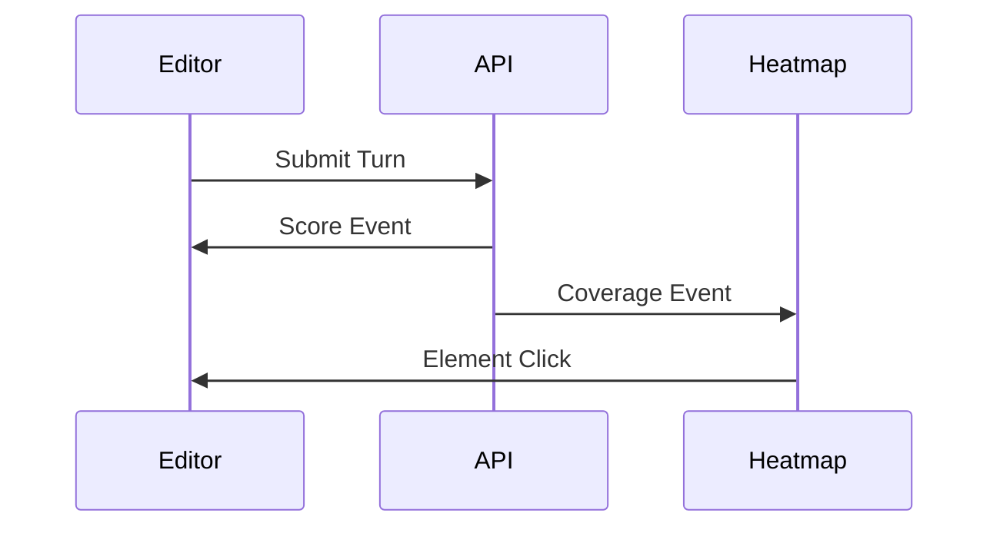
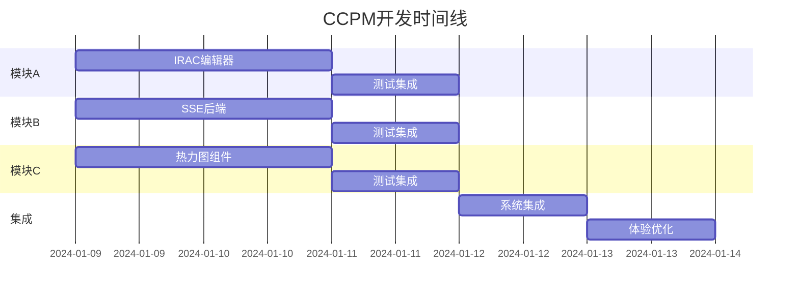

# CCPM (Claude Concurrent Project Management) 实施指南

## 🎯 项目并行开发策略

### 核心理念
将复杂的苏格拉底对话系统拆分为3个独立可并行开发的模块，通过明确的接口契约和MCP协议实现高效协作。

## 📋 模块划分与职责

### Module A: IRAC结构化编辑器
**负责人**: Claude实例A
**工作目录**: `/components/socratic/editor/`
**独立性**: 100%（纯前端组件）

```typescript
// 输入
interface EditorProps {
  facts: Fact[];
  laws: Law[];
  onSubmit: (turn: Turn) => void;
}

// 输出
interface Turn {
  issueId: string;
  stance: 'pro' | 'con';
  issue: string;
  rule: string;
  application: string;
  conclusion: string;
  citedFacts: string[];
  citedLaws: string[];
}
```

**开发清单**:
1. [ ] IRAC四标签页组件
2. [ ] 事实/法条Chips拖拽
3. [ ] 引用验证闸门
4. [ ] 快速模板生成
5. [ ] 立场切换器
6. [ ] 90秒倒计时器

**Mock数据位置**: `/mock/editor-data.json`

---

### Module B: SSE实时交互流
**负责人**: Claude实例B
**工作目录**: `/app/api/socratic/`
**独立性**: 95%（依赖types定义）

```typescript
// 输入
POST /api/socratic/session
{
  caseId: string;
  issueId: string;
  turn: Turn;
}

// 输出 (SSE流)
data: {"type":"coach","tips":["..."]}
data: {"type":"score","rubric":{...}}
data: {"type":"challenge","challenge":{...}}
data: {"type":"end"}
```

**开发清单**:
1. [ ] SSE路由实现
2. [ ] 状态机编排
3. [ ] 评分服务集成
4. [ ] 挑战生成集成
5. [ ] 错误处理
6. [ ] 会话持久化

**测试工具**: 
```bash
# 测试SSE流
curl -N -H "Accept: text/event-stream" \
  -H "Content-Type: application/json" \
  -d '{"caseId":"test","turn":{...}}' \
  http://localhost:3000/api/socratic/session
```

---

### Module C: 要件覆盖热力图
**负责人**: Claude实例C
**工作目录**: `/components/socratic/visualization/`
**独立性**: 100%（纯可视化组件）

```typescript
// 输入
interface HeatmapProps {
  elements: string[];
  coverage: ElementCoverage[];
  onElementClick: (elementId: string) => void;
}

// 输出
interface ElementClickEvent {
  elementId: string;
  guidingQuestion: string;
}
```

**开发清单**:
1. [ ] Grid布局实现
2. [ ] 覆盖度颜色映射
3. [ ] Tooltip引导问题
4. [ ] 点击交互
5. [ ] 动画效果
6. [ ] 进度百分比

**Mock数据位置**: `/mock/heatmap-data.json`

---

## 🔄 接口契约规范

### 共享类型定义
所有模块共享 `/lib/socratic/types.ts`

### 事件总线契约
```typescript
// 模块间通信事件
type ModuleEvent =
  | { source: 'editor'; type: 'turn_submitted'; data: Turn }
  | { source: 'api'; type: 'score_received'; data: RubricScore }
  | { source: 'heatmap'; type: 'element_selected'; data: string }
```

### 数据流向


---

## 🚀 并行开发启动脚本

### 1. 初始化（主Claude执行）
```bash
#!/bin/bash
# ccpm-init.sh

# 创建模块目录
mkdir -p components/socratic/{editor,visualization,session}
mkdir -p app/api/socratic/session
mkdir -p mock

# 创建共享契约文件
cat > contracts.ts << 'EOF'
// 模块间接口契约
export interface ModuleContracts {
  editor: {
    input: EditorProps;
    output: Turn;
  };
  api: {
    input: SessionRequest;
    output: SocraticEvent;
  };
  heatmap: {
    input: HeatmapProps;
    output: ElementClickEvent;
  };
}
EOF

# 创建Mock数据
cat > mock/shared-data.json << 'EOF'
{
  "facts": [
    {"id": "F1", "content": "原告于2024年1月1日签订合同"},
    {"id": "F2", "content": "被告未按期履行付款义务"}
  ],
  "laws": [
    {"id": "L1", "title": "合同法第52条", "content": "..."},
    {"id": "L2", "title": "合同法第107条", "content": "..."}
  ],
  "elements": ["合同成立", "违约行为", "损害结果", "因果关系"]
}
EOF

echo "CCPM环境初始化完成！"
```

### 2. 模块A启动（Claude窗口A）
```bash
# 专注前端组件开发
cd components/socratic/editor
npm run dev # 如果有独立dev server
# 或使用 Storybook
npm run storybook
```

### 3. 模块B启动（Claude窗口B）
```bash
# 专注API开发
cd app/api/socratic
# 使用独立的API测试环境
npm run dev:api
```

### 4. 模块C启动（Claude窗口C）
```bash
# 专注可视化组件
cd components/socratic/visualization
npm run dev:viz
```

---

## 📊 进度追踪看板

### Kanban Board
```markdown
| TODO | IN PROGRESS | TESTING | DONE |
|------|-------------|---------|------|
| A1: IRAC标签页 | | | |
| A2: Chips拖拽 | | | |
| A3: 引用验证 | | | |
| B1: SSE路由 | | | |
| B2: 状态机 | | | |
| B3: 评分集成 | | | |
| C1: Grid布局 | | | |
| C2: 颜色映射 | | | |
| C3: 点击交互 | | | |
```

---

## 🔐 防冲突规则

### 1. 文件边界
- **不允许跨模块修改文件**
- **共享文件只能通过主Claude修改**

### 2. Git分支策略
```bash
main
├── feat/ccpm-main      # 主控分支
├── feat/ccpm-editor    # 模块A
├── feat/ccpm-api       # 模块B
└── feat/ccpm-heatmap   # 模块C
```

### 3. 合并策略
```bash
# 每日定时合并（避免冲突积累）
git checkout feat/ccpm-main
git merge --no-ff feat/ccpm-editor
git merge --no-ff feat/ccpm-api
git merge --no-ff feat/ccpm-heatmap
```

---

## 🎯 成功标准

### 模块独立性
- [ ] 每个模块可以独立运行和测试
- [ ] Mock数据完整且一致
- [ ] 接口契约明确且稳定

### 集成顺畅度
- [ ] 模块集成无需修改核心逻辑
- [ ] 错误处理完善
- [ ] 性能达标（<2s响应）

### 用户体验
- [ ] IRAC编辑器操作流畅
- [ ] SSE实时反馈无延迟
- [ ] 热力图交互直观

---

## 💡 最佳实践

### 1. 通信原则
- 使用统一的contracts.ts定义
- 通过EventEmitter或Context传递数据
- 避免直接import其他模块的内部文件

### 2. 测试策略
- 每个模块100%单元测试覆盖
- 使用MSW模拟API响应
- Playwright做最终集成测试

### 3. 文档同步
- 每完成一个功能点更新此文档
- 接口变更必须通知所有模块
- 保持Mock数据与实际API同步

---

## 🚨 风险管理

### 潜在风险
1. **接口不匹配**: 定期接口对接测试
2. **性能问题**: 各模块独立性能测试
3. **集成困难**: 预留集成缓冲时间

### 应急预案
- 保持主分支始终可运行
- 每个模块有独立的回退方案
- 关键路径有备选实现

---

## 📅 时间线



---

## 🎉 快速开始

```bash
# 1. 复制此文档到项目
cp ccpm-setup.md /project/docs/

# 2. 运行初始化脚本
bash ccpm-init.sh

# 3. 分配Claude实例
# - Claude A: 打开 components/socratic/editor/
# - Claude B: 打开 app/api/socratic/
# - Claude C: 打开 components/socratic/visualization/

# 4. 开始并行开发！
```

记住：**清晰的边界 + 明确的契约 = 高效的并行开发**