# 苏格拉底对话系统增强实现详解

## 📋 修改文件总览

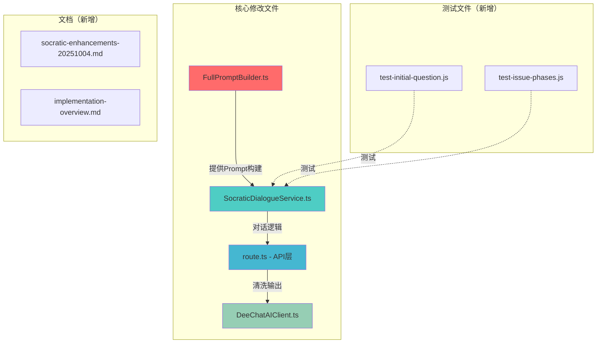
```mermaid
graph TB
    subgraph "核心修改文件"
        A[FullPromptBuilder.ts]
        B[SocraticDialogueService.ts]
        C[route.ts - API层]
        D[DeeChatAIClient.ts]
    end

    subgraph "测试文件（新增）"
        E[test-initial-question.js]
        F[test-issue-phases.js]
    end

    subgraph "文档（新增）"
        G[socratic-enhancements-20251004.md]
        H[implementation-overview.md]
    end

    A -->|提供Prompt构建| B
    B -->|对话逻辑| C
    C -->|清洗输出| D

    E -.测试.-> B
    F -.测试.-> B

    style A fill:#ff6b6b
    style B fill:#4ecdc4
    style C fill:#45b7d1
    style D fill:#96ceb4
```

---

## 🎯 功能1: 初始问题自动生成

### 实现流程

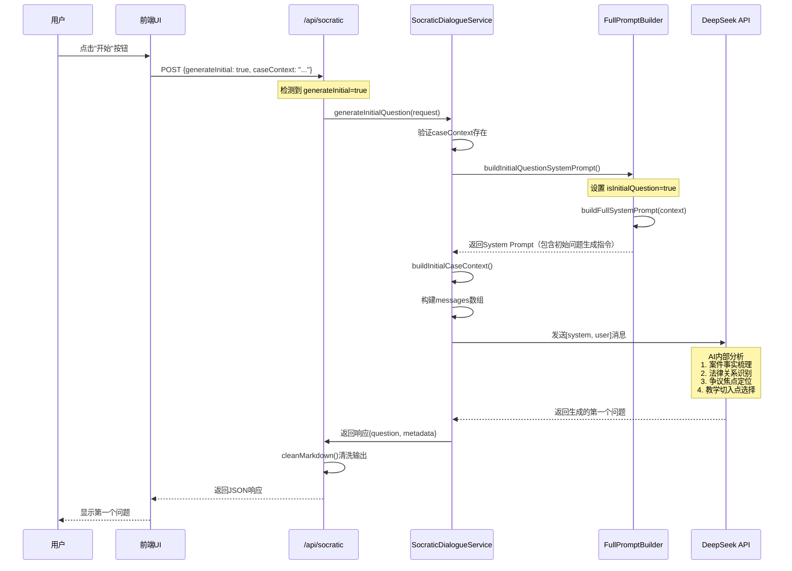
```mermaid
sequenceDiagram
    participant User as 用户
    participant UI as 前端UI
    participant API as /api/socratic
    participant Service as SocraticDialogueService
    participant Builder as FullPromptBuilder
    participant AI as DeepSeek API

    User->>UI: 点击"开始"按钮
    UI->>API: POST {generateInitial: true, caseContext: "..."}

    Note over API: 检测到 generateInitial=true
    API->>Service: generateInitialQuestion(request)

    Service->>Service: 验证caseContext存在
    Service->>Builder: buildInitialQuestionSystemPrompt()

    Note over Builder: 设置 isInitialQuestion=true
    Builder->>Builder: buildFullSystemPrompt(context)
    Builder-->>Service: 返回System Prompt（包含初始问题生成指令）

    Service->>Service: buildInitialCaseContext()
    Service->>Service: 构建messages数组

    Service->>AI: 发送[system, user]消息

    Note over AI: AI内部分析<br/>1. 案件事实梳理<br/>2. 法律关系识别<br/>3. 争议焦点定位<br/>4. 教学切入点选择

    AI-->>Service: 返回生成的第一个问题
    Service->>API: 返回响应{question, metadata}
    API->>API: cleanMarkdown()清洗输出
    API-->>UI: 返回JSON响应
    UI-->>User: 显示第一个问题
```

### 核心代码路径

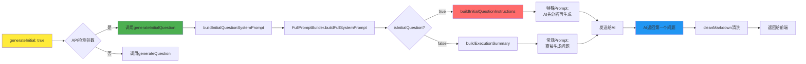
```mermaid
graph LR
    A[generateInitial: true] --> B{API检测参数}
    B -->|是| C[调用generateInitialQuestion]
    B -->|否| D[调用generateQuestion]

    C --> E[buildInitialQuestionSystemPrompt]
    E --> F[FullPromptBuilder.buildFullSystemPrompt]
    F --> G{isInitialQuestion?}
    G -->|true| H[buildInitialQuestionInstructions]
    G -->|false| I[buildExecutionSummary]

    H --> J[特殊Prompt:<br/>AI先分析再生成]
    I --> K[常规Prompt:<br/>直接生成问题]

    J --> L[发送给AI]
    K --> L

    L --> M[AI返回第一个问题]
    M --> N[cleanMarkdown清洗]
    N --> O[返回给前端]

    style A fill:#ffeb3b
    style C fill:#4caf50
    style H fill:#ff6b6b
    style M fill:#2196f3
```

### 关键修改点

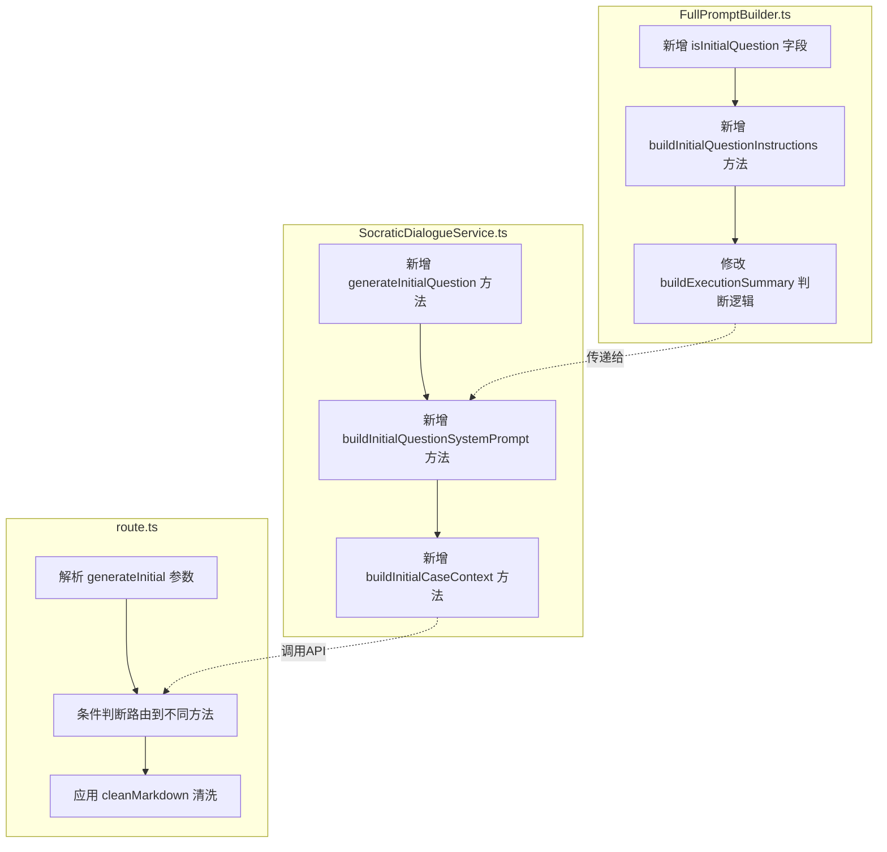
```mermaid
graph TD
    subgraph "FullPromptBuilder.ts"
        A1[新增 isInitialQuestion 字段]
        A2[新增 buildInitialQuestionInstructions 方法]
        A3[修改 buildExecutionSummary 判断逻辑]
    end

    subgraph "SocraticDialogueService.ts"
        B1[新增 generateInitialQuestion 方法]
        B2[新增 buildInitialQuestionSystemPrompt 方法]
        B3[新增 buildInitialCaseContext 方法]
    end

    subgraph "route.ts"
        C1[解析 generateInitial 参数]
        C2[条件判断路由到不同方法]
        C3[应用 cleanMarkdown 清洗]
    end

    A1 --> A2
    A2 --> A3
    B1 --> B2
    B2 --> B3
    C1 --> C2
    C2 --> C3

    A3 -.传递给.-> B2
    B3 -.调用API.-> C2
```

---

## 🎯 功能2: ISSUE阶段差异化Prompt

### 五阶段策略

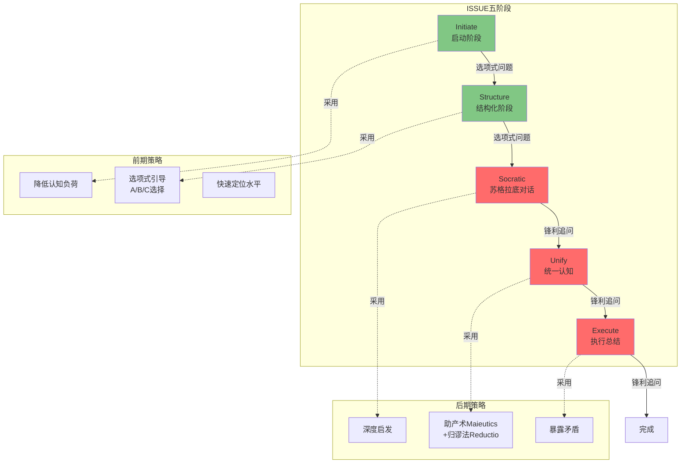
```mermaid
graph TB
    subgraph "ISSUE五阶段"
        I[Initiate<br/>启动阶段]
        S[Structure<br/>结构化阶段]
        SO[Socratic<br/>苏格拉底对话]
        U[Unify<br/>统一认知]
        E[Execute<br/>执行总结]
    end

    I -->|选项式问题| S
    S -->|选项式问题| SO
    SO -->|锋利追问| U
    U -->|锋利追问| E
    E -->|锋利追问| END[完成]

    subgraph "前期策略"
        direction TB
        P1[降低认知负荷]
        P2[选项式引导<br/>A/B/C选择]
        P3[快速定位水平]
    end

    subgraph "后期策略"
        direction TB
        L1[深度启发]
        L2[助产术Maieutics<br/>+归谬法Reductio]
        L3[暴露矛盾]
    end

    I -.采用.-> P1
    S -.采用.-> P2
    SO -.采用.-> L1
    U -.采用.-> L2
    E -.采用.-> L3

    style I fill:#81c784
    style S fill:#81c784
    style SO fill:#ff6b6b
    style U fill:#ff6b6b
    style E fill:#ff6b6b
```

### 实现流程

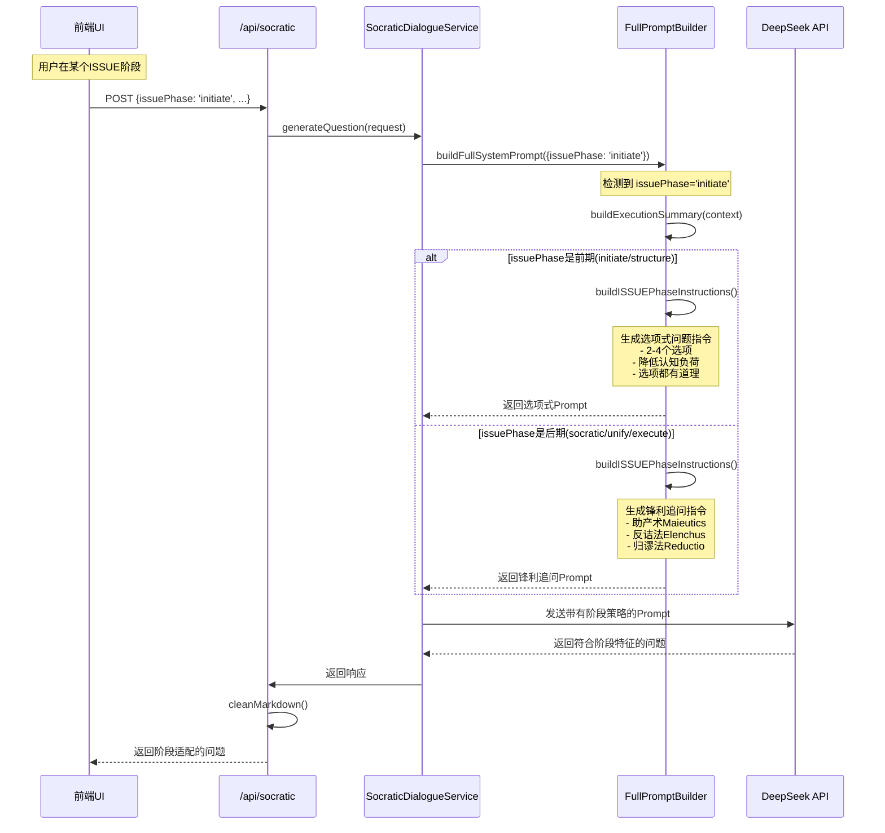
```mermaid
sequenceDiagram
    participant UI as 前端UI
    participant API as /api/socratic
    participant Service as SocraticDialogueService
    participant Builder as FullPromptBuilder
    participant AI as DeepSeek API

    Note over UI: 用户在某个ISSUE阶段
    UI->>API: POST {issuePhase: 'initiate', ...}

    API->>Service: generateQuestion(request)
    Service->>Builder: buildFullSystemPrompt({issuePhase: 'initiate'})

    Note over Builder: 检测到 issuePhase='initiate'
    Builder->>Builder: buildExecutionSummary(context)

    alt issuePhase是前期(initiate/structure)
        Builder->>Builder: buildISSUEPhaseInstructions()
        Note over Builder: 生成选项式问题指令<br/>- 2-4个选项<br/>- 降低认知负荷<br/>- 选项都有道理
        Builder-->>Service: 返回选项式Prompt
    else issuePhase是后期(socratic/unify/execute)
        Builder->>Builder: buildISSUEPhaseInstructions()
        Note over Builder: 生成锋利追问指令<br/>- 助产术Maieutics<br/>- 反诘法Elenchus<br/>- 归谬法Reductio
        Builder-->>Service: 返回锋利追问Prompt
    end

    Service->>AI: 发送带有阶段策略的Prompt
    AI-->>Service: 返回符合阶段特征的问题
    Service->>API: 返回响应
    API->>API: cleanMarkdown()
    API-->>UI: 返回阶段适配的问题
```

### 差异化Prompt内容对比

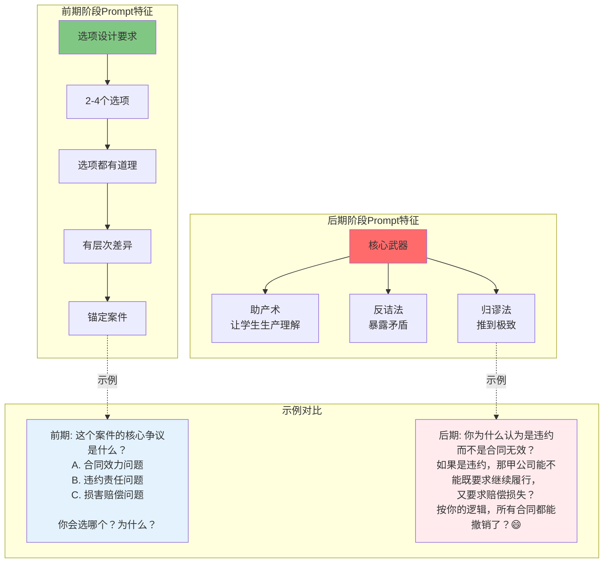
```mermaid
graph TB
    subgraph "前期阶段Prompt特征"
        direction LR
        E1[选项设计要求]
        E2[2-4个选项]
        E3[选项都有道理]
        E4[有层次差异]
        E5[锚定案件]

        E1 --> E2
        E2 --> E3
        E3 --> E4
        E4 --> E5
    end

    subgraph "后期阶段Prompt特征"
        direction LR
        L1[核心武器]
        L2[助产术<br/>让学生生产理解]
        L3[反诘法<br/>暴露矛盾]
        L4[归谬法<br/>推到极致]

        L1 --> L2
        L1 --> L3
        L1 --> L4
    end

    subgraph "示例对比"
        direction TB
        EX1["前期: 这个案件的核心争议是什么？<br/>A. 合同效力问题<br/>B. 违约责任问题<br/>C. 损害赔偿问题<br/><br/>你会选哪个？为什么？"]

        EX2["后期: 你为什么认为是违约而不是合同无效？<br/>如果是违约，那甲公司能不能既要求继续履行，<br/>又要求赔偿损失？<br/>按你的逻辑，所有合同都能撤销了？😄"]
    end

    E5 -.示例.-> EX1
    L4 -.示例.-> EX2

    style E1 fill:#81c784
    style L1 fill:#ff6b6b
    style EX1 fill:#e3f2fd
    style EX2 fill:#ffebee
```

### 关键修改点

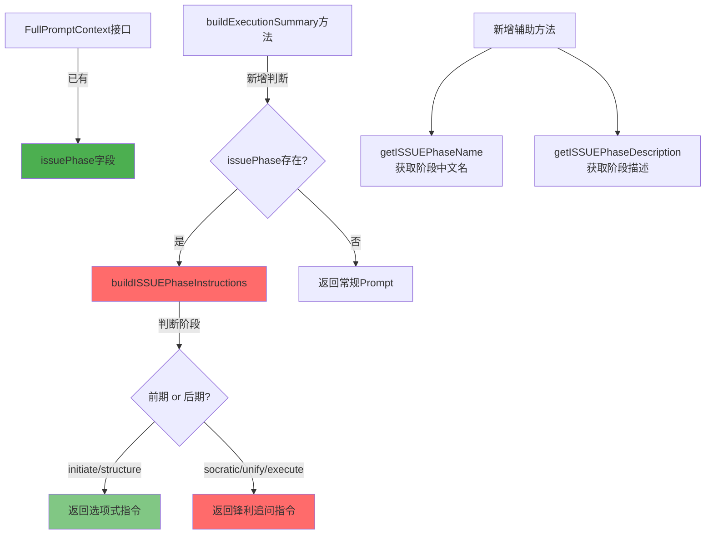
```mermaid
graph TD
    A[FullPromptContext接口] -->|已有| B[issuePhase字段]

    C[buildExecutionSummary方法] -->|新增判断| D{issuePhase存在?}
    D -->|是| E[buildISSUEPhaseInstructions]
    D -->|否| F[返回常规Prompt]

    E -->|判断阶段| G{前期 or 后期?}
    G -->|initiate/structure| H[返回选项式指令]
    G -->|socratic/unify/execute| I[返回锋利追问指令]

    J[新增辅助方法]
    J --> K[getISSUEPhaseName<br/>获取阶段中文名]
    J --> L[getISSUEPhaseDescription<br/>获取阶段描述]

    style B fill:#4caf50
    style E fill:#ff6b6b
    style H fill:#81c784
    style I fill:#ff6b6b
```

---

## 🎯 功能3: Markdown输出增强清洗

### 清洗前后对比

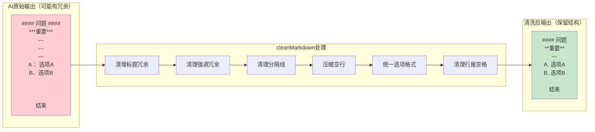
```mermaid
graph LR
    subgraph "AI原始输出（可能有冗余）"
        A1["#### 问题 ####<br/>***重要***<br/>---<br/>---<br/>---<br/>A： 选项A<br/>B、选项B<br/><br/><br/><br/>结束   "]
    end

    subgraph "cleanMarkdown处理"
        B1[清理标题冗余]
        B2[清理强调冗余]
        B3[清理分隔线]
        B4[压缩空行]
        B5[统一选项格式]
        B6[清理行尾空格]
    end

    subgraph "清洗后输出（保留结构）"
        C1["#### 问题<br/>**重要**<br/>---<br/>A. 选项A<br/>B. 选项B<br/><br/>结束"]
    end

    A1 --> B1
    B1 --> B2
    B2 --> B3
    B3 --> B4
    B4 --> B5
    B5 --> B6
    B6 --> C1

    style A1 fill:#ffcdd2
    style C1 fill:#c8e6c9
```

### 新旧函数对比

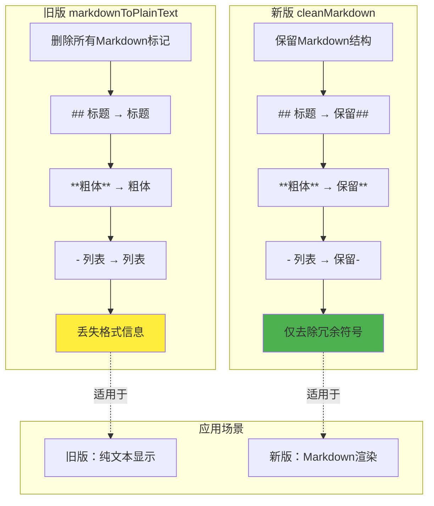
```mermaid
graph TB
    subgraph "旧版 markdownToPlainText"
        O1[删除所有Markdown标记]
        O2[## 标题 → 标题]
        O3[**粗体** → 粗体]
        O4[- 列表 → 列表]
        O5[丢失格式信息]

        O1 --> O2
        O2 --> O3
        O3 --> O4
        O4 --> O5
    end

    subgraph "新版 cleanMarkdown"
        N1[保留Markdown结构]
        N2[## 标题 → 保留##]
        N3[**粗体** → 保留**]
        N4[- 列表 → 保留-]
        N5[仅去除冗余符号]

        N1 --> N2
        N2 --> N3
        N3 --> N4
        N4 --> N5
    end

    subgraph "应用场景"
        S1[旧版：纯文本显示]
        S2[新版：Markdown渲染]
    end

    O5 -.适用于.-> S1
    N5 -.适用于.-> S2

    style O5 fill:#ffeb3b
    style N5 fill:#4caf50
```

### 清洗规则详解

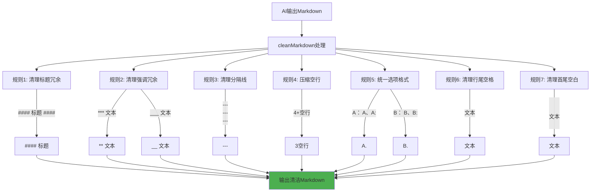
```mermaid
graph TD
    A[AI输出Markdown] --> B[cleanMarkdown处理]

    B --> C[规则1: 清理标题冗余]
    C -->|#### 标题 ####| C1[#### 标题]

    B --> D[规则2: 清理强调冗余]
    D -->|*** 文本| D1[** 文本]
    D -->|___ 文本| D2[__ 文本]

    B --> E[规则3: 清理分隔线]
    E -->|---<br/>---<br/>---| E1[---]

    B --> F[规则4: 压缩空行]
    F -->|4+空行| F1[3空行]

    B --> G[规则5: 统一选项格式]
    G -->|A： A、A:| G1[A.]
    G -->|B： B、B:| G2[B.]

    B --> H[规则6: 清理行尾空格]
    H -->|"文本   \n"| H1["文本\n"]

    B --> I[规则7: 清理首尾空白]
    I -->|"\n\n文本\n\n"| I1["文本"]

    C1 --> J[输出清洁Markdown]
    D1 --> J
    D2 --> J
    E1 --> J
    F1 --> J
    G1 --> J
    G2 --> J
    H1 --> J
    I1 --> J

    style J fill:#4caf50
```

### 实现位置

```mermaid
graph LR
    A[DeeChatAIClient.ts] -->|新增| B[cleanMarkdown函数]
    A -->|保留| C[markdownToPlainText<br/>@deprecated]

    D[route.ts] -->|替换调用| E[使用cleanMarkdown]
    E -->|处理| F[result.data.content]
    E -->|处理| G[result.data.question]

    B -.被调用.-> E

    style B fill:#4caf50
    style C fill:#ff9800
    style E fill:#2196f3
```

---

## 🔄 完整数据流转

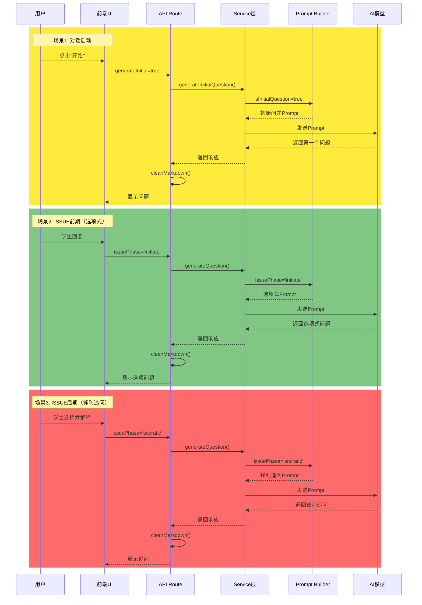
```mermaid
sequenceDiagram
    participant User as 用户
    participant UI as 前端UI
    participant API as API Route
    participant Service as Service层
    participant Builder as Prompt Builder
    participant AI as AI模型

    rect rgb(255, 235, 59)
        Note over User,UI: 场景1: 对话启动
        User->>UI: 点击"开始"
        UI->>API: generateInitial=true
        API->>Service: generateInitialQuestion()
        Service->>Builder: isInitialQuestion=true
        Builder-->>Service: 初始问题Prompt
        Service->>AI: 发送Prompt
        AI-->>Service: 返回第一个问题
        Service-->>API: 返回响应
        API->>API: cleanMarkdown()
        API-->>UI: 显示问题
    end

    rect rgb(129, 199, 132)
        Note over User,UI: 场景2: ISSUE前期（选项式）
        User->>UI: 学生回复
        UI->>API: issuePhase='initiate'
        API->>Service: generateQuestion()
        Service->>Builder: issuePhase='initiate'
        Builder-->>Service: 选项式Prompt
        Service->>AI: 发送Prompt
        AI-->>Service: 返回选项式问题
        Service-->>API: 返回响应
        API->>API: cleanMarkdown()
        API-->>UI: 显示选项问题
    end

    rect rgb(255, 107, 107)
        Note over User,UI: 场景3: ISSUE后期（锋利追问）
        User->>UI: 学生选择并解释
        UI->>API: issuePhase='socratic'
        API->>Service: generateQuestion()
        Service->>Builder: issuePhase='socratic'
        Builder-->>Service: 锋利追问Prompt
        Service->>AI: 发送Prompt
        AI-->>Service: 返回锋利追问
        Service-->>API: 返回响应
        API->>API: cleanMarkdown()
        API-->>UI: 显示追问
    end
```

---

## 📊 架构对比

### Prompt构建架构对比

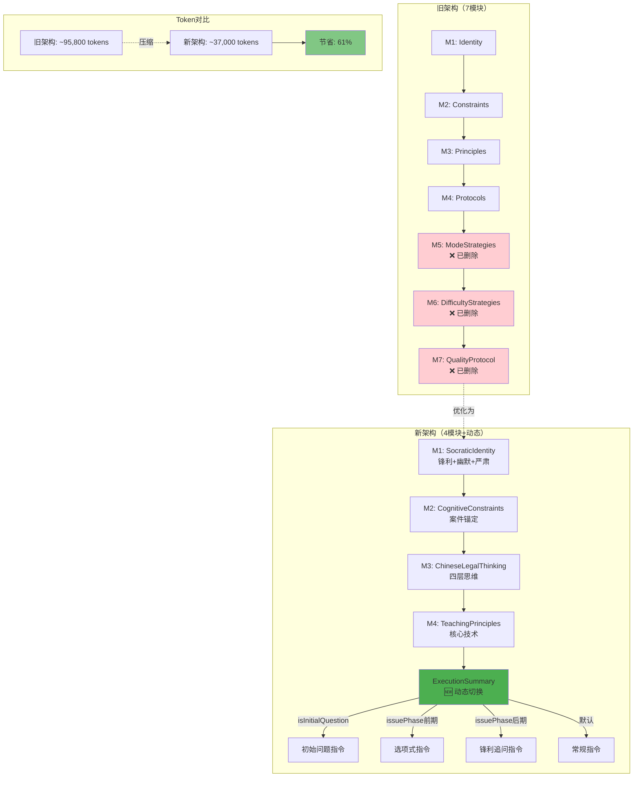
```mermaid
graph TB
    subgraph "旧架构（7模块）"
        direction LR
        O1[M1: Identity]
        O2[M2: Constraints]
        O3[M3: Principles]
        O4[M4: Protocols]
        O5[M5: ModeStrategies<br/>❌ 已删除]
        O6[M6: DifficultyStrategies<br/>❌ 已删除]
        O7[M7: QualityProtocol<br/>❌ 已删除]

        O1 --> O2
        O2 --> O3
        O3 --> O4
        O4 --> O5
        O5 --> O6
        O6 --> O7
    end

    subgraph "新架构（4模块+动态）"
        direction LR
        N1[M1: SocraticIdentity<br/>锋利+幽默+严肃]
        N2[M2: CognitiveConstraints<br/>案件锚定]
        N3[M3: ChineseLegalThinking<br/>四层思维]
        N4[M4: TeachingPrinciples<br/>核心技术]
        N5[ExecutionSummary<br/>🆕 动态切换]

        N1 --> N2
        N2 --> N3
        N3 --> N4
        N4 --> N5

        N5 -->|isInitialQuestion| N6[初始问题指令]
        N5 -->|issuePhase前期| N7[选项式指令]
        N5 -->|issuePhase后期| N8[锋利追问指令]
        N5 -->|默认| N9[常规指令]
    end

    subgraph "Token对比"
        T1[旧架构: ~95,800 tokens]
        T2[新架构: ~37,000 tokens]
        T3[节省: 61%]
    end

    O7 -.优化为.-> N1
    T1 -.压缩.-> T2
    T2 --> T3

    style O5 fill:#ffcdd2
    style O6 fill:#ffcdd2
    style O7 fill:#ffcdd2
    style N5 fill:#4caf50
    style T3 fill:#81c784
```

### 方法调用链路

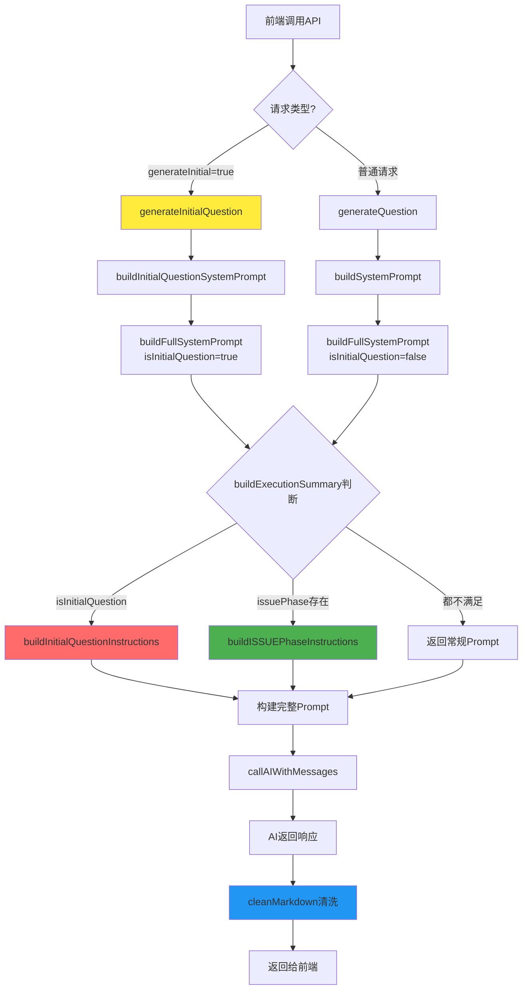
```mermaid
graph TD
    A[前端调用API] --> B{请求类型?}

    B -->|generateInitial=true| C[generateInitialQuestion]
    B -->|普通请求| D[generateQuestion]

    C --> E[buildInitialQuestionSystemPrompt]
    D --> F[buildSystemPrompt]

    E --> G[buildFullSystemPrompt<br/>isInitialQuestion=true]
    F --> H[buildFullSystemPrompt<br/>isInitialQuestion=false]

    G --> I{buildExecutionSummary判断}
    H --> I

    I -->|isInitialQuestion| J[buildInitialQuestionInstructions]
    I -->|issuePhase存在| K[buildISSUEPhaseInstructions]
    I -->|都不满足| L[返回常规Prompt]

    J --> M[构建完整Prompt]
    K --> M
    L --> M

    M --> N[callAIWithMessages]
    N --> O[AI返回响应]
    O --> P[cleanMarkdown清洗]
    P --> Q[返回给前端]

    style C fill:#ffeb3b
    style J fill:#ff6b6b
    style K fill:#4caf50
    style P fill:#2196f3
```

---

## 🎓 效果实现原理

### 初始问题如何实现"先分析再生成"

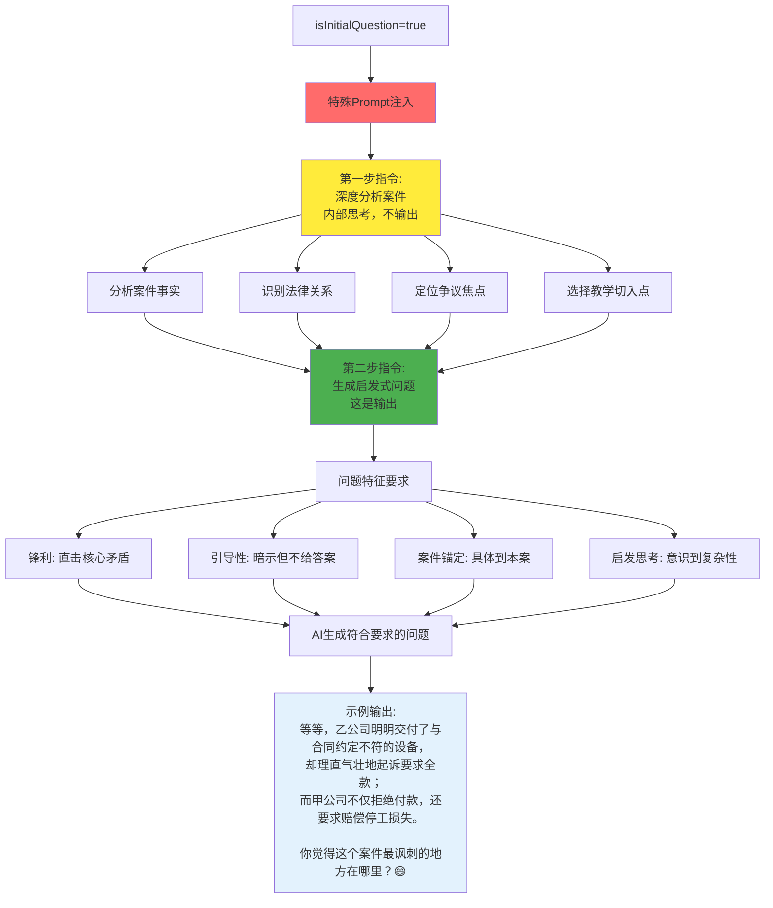
```mermaid
graph TB
    A[isInitialQuestion=true] --> B[特殊Prompt注入]

    B --> C[第一步指令:<br/>深度分析案件<br/>内部思考，不输出]

    C --> D1[分析案件事实]
    C --> D2[识别法律关系]
    C --> D3[定位争议焦点]
    C --> D4[选择教学切入点]

    D1 --> E[第二步指令:<br/>生成启发式问题<br/>这是输出]
    D2 --> E
    D3 --> E
    D4 --> E

    E --> F[问题特征要求]
    F --> F1[锋利: 直击核心矛盾]
    F --> F2[引导性: 暗示但不给答案]
    F --> F3[案件锚定: 具体到本案]
    F --> F4[启发思考: 意识到复杂性]

    F1 --> G[AI生成符合要求的问题]
    F2 --> G
    F3 --> G
    F4 --> G

    G --> H[示例输出:<br/>等等，乙公司明明交付了与合同约定不符的设备，<br/>却理直气壮地起诉要求全款；<br/>而甲公司不仅拒绝付款，还要求赔偿停工损失。<br/><br/>你觉得这个案件最讽刺的地方在哪里？😄]

    style B fill:#ff6b6b
    style C fill:#ffeb3b
    style E fill:#4caf50
    style H fill:#e3f2fd
```

### ISSUE阶段如何实现差异化

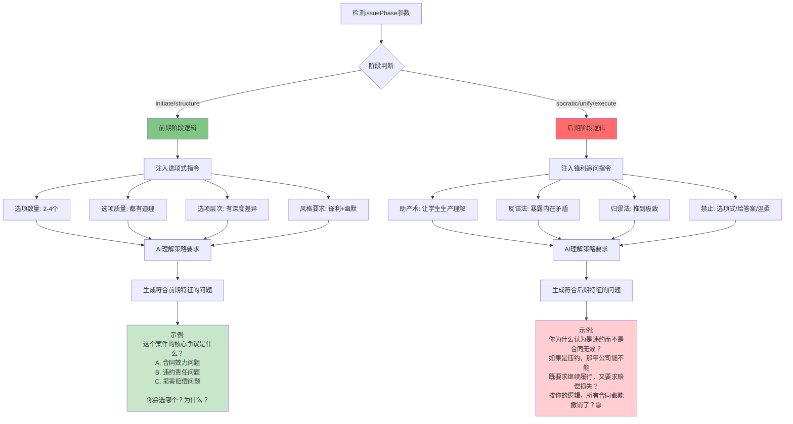
```mermaid
graph TB
    A[检测issuePhase参数] --> B{阶段判断}

    B -->|initiate/structure| C[前期阶段逻辑]
    B -->|socratic/unify/execute| D[后期阶段逻辑]

    C --> E[注入选项式指令]
    E --> E1[选项数量: 2-4个]
    E --> E2[选项质量: 都有道理]
    E --> E3[选项层次: 有深度差异]
    E --> E4[风格要求: 锋利+幽默]

    D --> F[注入锋利追问指令]
    F --> F1[助产术: 让学生生产理解]
    F --> F2[反诘法: 暴露内在矛盾]
    F --> F3[归谬法: 推到极致]
    F --> F4[禁止: 选项式/给答案/温柔]

    E1 --> G[AI理解策略要求]
    E2 --> G
    E3 --> G
    E4 --> G

    F1 --> H[AI理解策略要求]
    F2 --> H
    F3 --> H
    F4 --> H

    G --> I[生成符合前期特征的问题]
    H --> J[生成符合后期特征的问题]

    I --> K[示例:<br/>这个案件的核心争议是什么？<br/>A. 合同效力问题<br/>B. 违约责任问题<br/>C. 损害赔偿问题<br/><br/>你会选哪个？为什么？]

    J --> L[示例:<br/>你为什么认为是违约而不是合同无效？<br/>如果是违约，那甲公司能不能<br/>既要求继续履行，又要求赔偿损失？<br/>按你的逻辑，所有合同都能撤销了？😄]

    style C fill:#81c784
    style D fill:#ff6b6b
    style K fill:#c8e6c9
    style L fill:#ffcdd2
```

### Markdown清洗如何保留结构

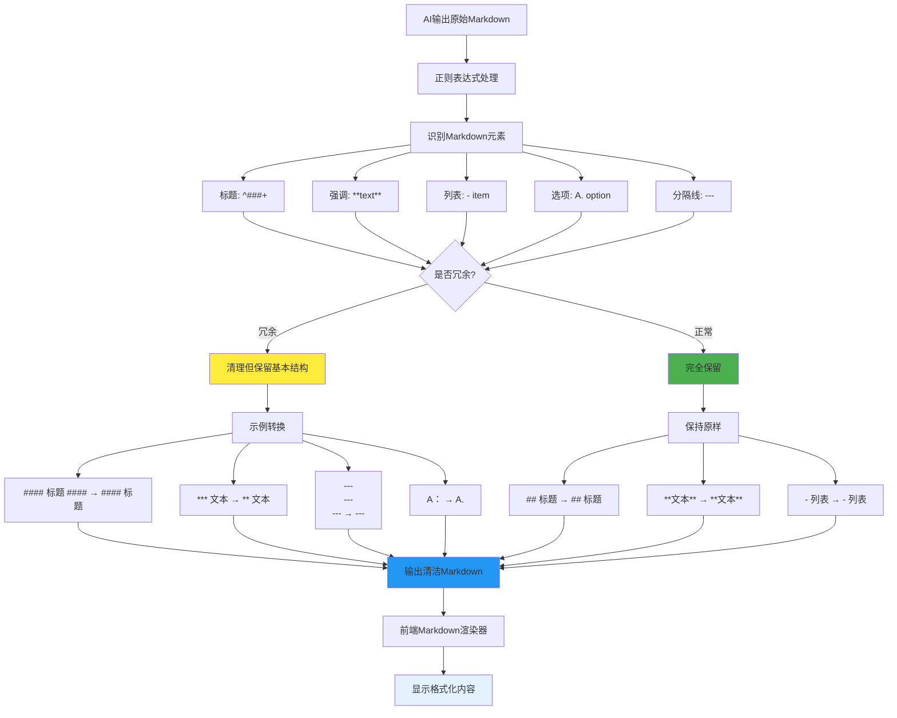
```mermaid
graph TB
    A[AI输出原始Markdown] --> B[正则表达式处理]

    B --> C[识别Markdown元素]
    C --> C1[标题: ^###+]
    C --> C2[强调: **text**]
    C --> C3[列表: - item]
    C --> C4[选项: A. option]
    C --> C5[分隔线: ---]

    C1 --> D{是否冗余?}
    C2 --> D
    C3 --> D
    C4 --> D
    C5 --> D

    D -->|冗余| E[清理但保留基本结构]
    D -->|正常| F[完全保留]

    E --> G[示例转换]
    G --> G1["#### 标题 #### → #### 标题"]
    G --> G2["*** 文本 → ** 文本"]
    G --> G3["---\n---\n--- → ---"]
    G --> G4["A： → A."]

    F --> H[保持原样]
    H --> H1["## 标题 → ## 标题"]
    H --> H2["**文本** → **文本**"]
    H --> H3["- 列表 → - 列表"]

    G1 --> I[输出清洁Markdown]
    G2 --> I
    G3 --> I
    G4 --> I
    H1 --> I
    H2 --> I
    H3 --> I

    I --> J[前端Markdown渲染器]
    J --> K[显示格式化内容]

    style E fill:#ffeb3b
    style F fill:#4caf50
    style I fill:#2196f3
    style K fill:#e3f2fd
```

---

## 🎯 三大功能协同工作

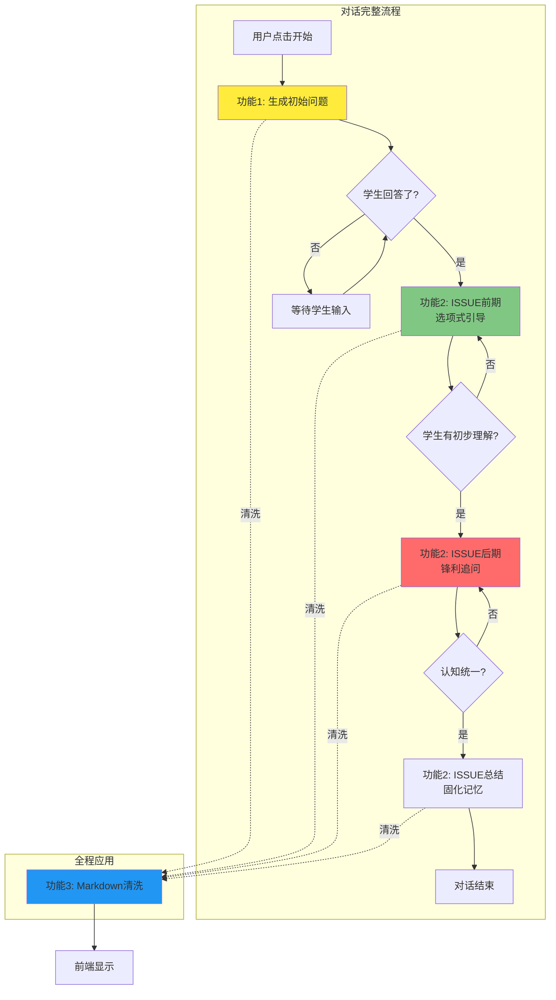
```mermaid
graph TB
    subgraph "对话完整流程"
        START[用户点击开始] --> INIT[功能1: 生成初始问题]

        INIT --> CHECK1{学生回答了?}
        CHECK1 -->|是| EARLY[功能2: ISSUE前期<br/>选项式引导]
        CHECK1 -->|否| WAIT1[等待学生输入]
        WAIT1 --> CHECK1

        EARLY --> CHECK2{学生有初步理解?}
        CHECK2 -->|是| DEEP[功能2: ISSUE后期<br/>锋利追问]
        CHECK2 -->|否| EARLY

        DEEP --> CHECK3{认知统一?}
        CHECK3 -->|是| FINAL[功能2: ISSUE总结<br/>固化记忆]
        CHECK3 -->|否| DEEP

        FINAL --> END[对话结束]
    end

    subgraph "全程应用"
        CLEAN[功能3: Markdown清洗]
    end

    INIT -.清洗.-> CLEAN
    EARLY -.清洗.-> CLEAN
    DEEP -.清洗.-> CLEAN
    FINAL -.清洗.-> CLEAN

    CLEAN --> DISPLAY[前端显示]

    style INIT fill:#ffeb3b
    style EARLY fill:#81c784
    style DEEP fill:#ff6b6b
    style CLEAN fill:#2196f3
```

---

## 📈 性能和质量提升

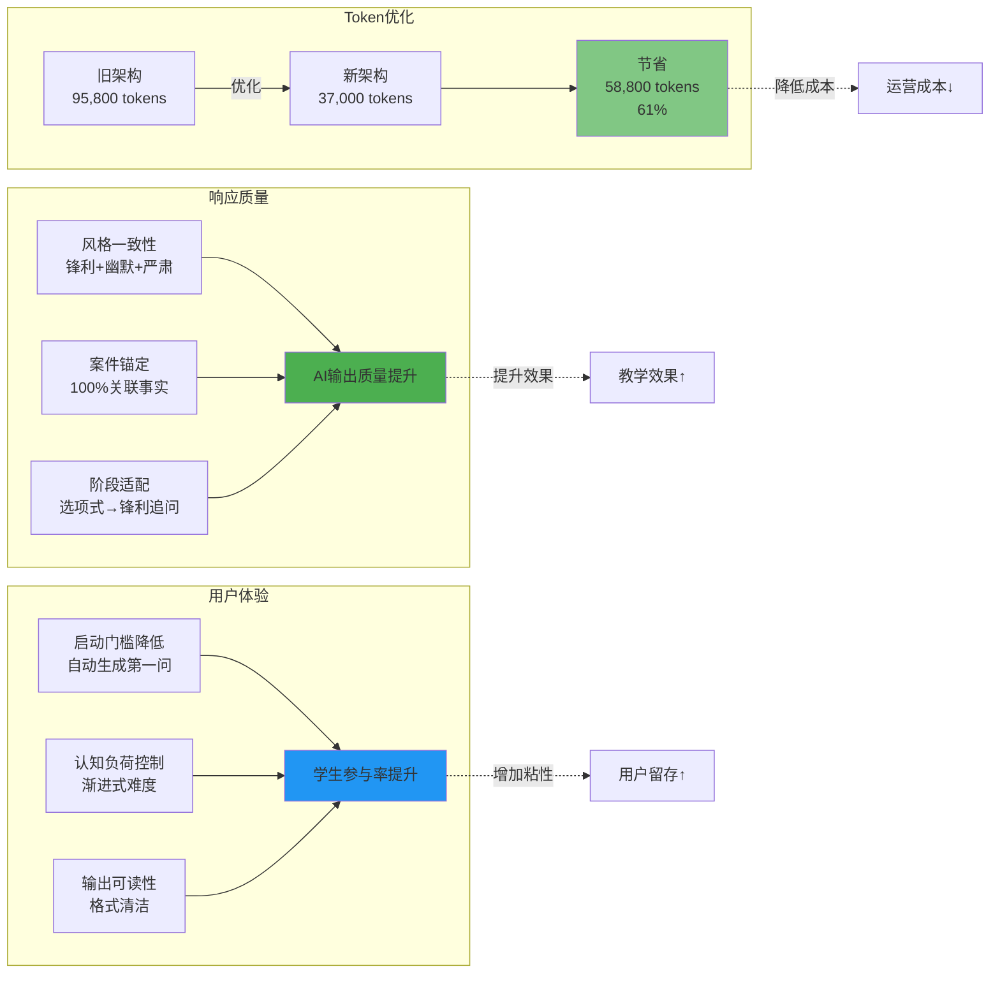
```mermaid
graph LR
    subgraph "Token优化"
        T1[旧架构<br/>95,800 tokens]
        T2[新架构<br/>37,000 tokens]
        T3[节省<br/>58,800 tokens<br/>61%]

        T1 -->|优化| T2
        T2 --> T3
    end

    subgraph "响应质量"
        Q1[风格一致性<br/>锋利+幽默+严肃]
        Q2[案件锚定<br/>100%关联事实]
        Q3[阶段适配<br/>选项式→锋利追问]

        Q1 --> Q4[AI输出质量提升]
        Q2 --> Q4
        Q3 --> Q4
    end

    subgraph "用户体验"
        U1[启动门槛降低<br/>自动生成第一问]
        U2[认知负荷控制<br/>渐进式难度]
        U3[输出可读性<br/>格式清洁]

        U1 --> U4[学生参与率提升]
        U2 --> U4
        U3 --> U4
    end

    T3 -.降低成本.-> COST[运营成本↓]
    Q4 -.提升效果.-> EDU[教学效果↑]
    U4 -.增加粘性.-> RET[用户留存↑]

    style T3 fill:#81c784
    style Q4 fill:#4caf50
    style U4 fill:#2196f3
```

---

## 🔧 技术实现总结

```mermaid
mindmap
  root((苏格拉底对话<br/>增强系统))
    功能1: 初始问题生成
      核心: isInitialQuestion标记
      Prompt: 先分析后生成指令
      API: generateInitialQuestion方法
      效果: 降低启动门槛

    功能2: ISSUE阶段差异化
      核心: issuePhase参数
      策略: 前期选项式+后期锋利追问
      实现: buildISSUEPhaseInstructions
      效果: 渐进式认知提升

    功能3: Markdown清洗
      核心: cleanMarkdown函数
      原则: 保留结构去除冗余
      规则: 7条正则替换
      效果: 输出更清爽

    技术架构
      4模块Prompt
      Token节省61%
      动态Prompt切换
      统一清洗出口

    质量保障
      测试脚本完善
      风格一致性检查
      案件锚定强制
      性能监控
```

---

**总结**: 通过三大功能的协同工作，实现了从对话启动、过程引导到输出优化的全流程增强。
