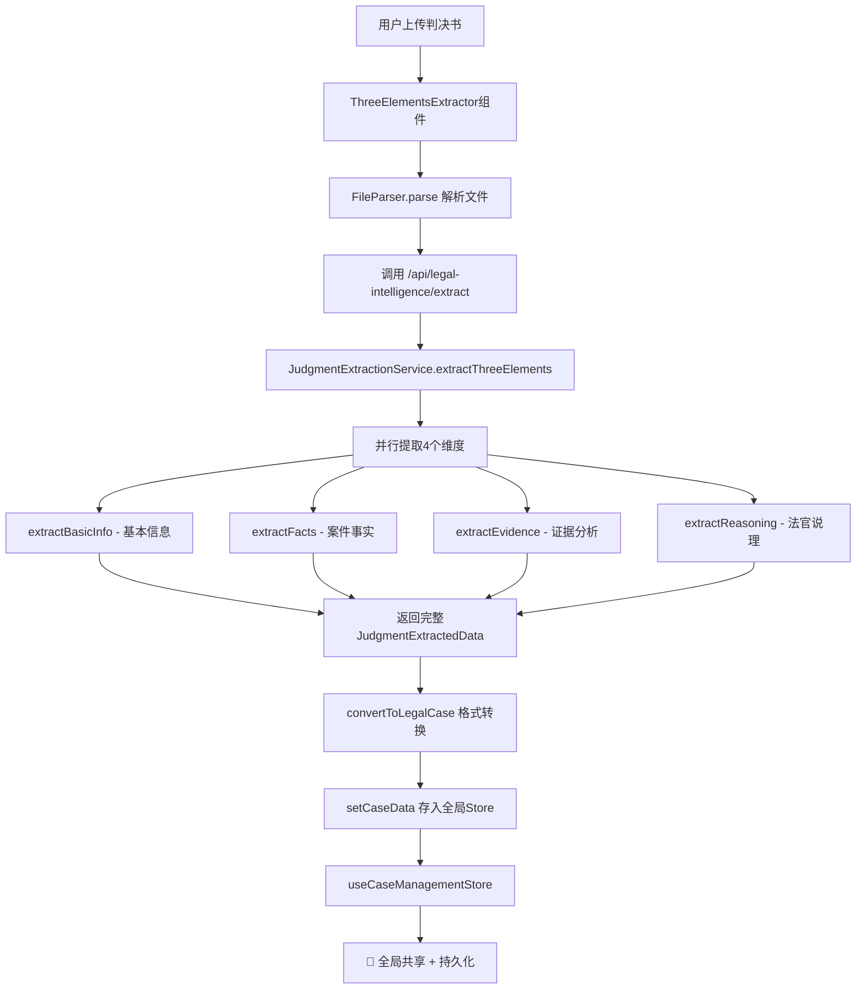

# 判决书提取数据流转机制

## 📊 当前架构分析

### 数据流转链路



### ✅ 当前已实现的"全局共用"

**1. 全局状态管理（Zustand）**
```typescript
// src/domains/case-management/stores/useCaseStore.ts
export const useCaseManagementStore = create<CaseManagementStore>()(
  persist(
    immer((set, get) => ({
      currentCase: null,  // 👈 当前案例（判决书提取后存这里）
      cases: [],          // 👈 案例列表
      // ...
    })),
    {
      name: 'case-management-store',
      partialize: (state) => ({
        currentCase: state.currentCase,  // 👈 持久化存储
        selectedCaseId: state.selectedCaseId,
        // ...
      })
    }
  )
);
```

**2. 数据注入点**
```typescript
// components/ThreeElementsExtractor.tsx:289-290
const legalCase = convertToLegalCase(result.data);
setCaseData(legalCase);  // 👈 存入全局store
```

**3. 数据消费端（任何组件都可以访问）**
```typescript
// 任何组件中
import { useCurrentCase, useCaseActions } from '@/src/domains/case-management/stores/useCaseStore';

function MyComponent() {
  const currentCase = useCurrentCase();  // 获取当前案例
  const { setCurrentCase } = useCaseActions();  // 获取操作方法

  // currentCase包含完整的判决书提取数据：
  // - basicInfo
  // - threeElements.facts
  // - threeElements.evidence
  // - threeElements.reasoning
}
```

## 🚀 全局共用的优势

✅ **避免重复提取**：一次提取，所有组件共享
✅ **持久化存储**：刷新页面后数据依然存在（localStorage）
✅ **跨组件通信**：任何组件都能访问最新的案例数据
✅ **统一数据源**：避免数据不一致问题

## 📍 当前消费端

以下组件/服务可以直接访问判决书数据：

1. **第二幕（Act2）- 深度分析**
   - 可以读取 `currentCase.threeElements` 进行进一步分析

2. **第三幕（Act3）- 苏格拉底对话**
   - 可以读取 `currentCase` 作为对话的案例上下文

3. **第四幕（Act4）- 总结提升**
   - 可以读取完整案例数据生成报告

4. **所有分析服务**
   - ClaimAnalysisService
   - DisputeAnalysisService
   - EvidenceIntelligenceService
   - TimelineAnalysisService
   - 都可以从store获取案例数据

## 🔍 数据访问示例

### 在组件中访问

```typescript
import { useCurrentCase } from '@/src/domains/case-management/stores/useCaseStore';

function SocraticDialogue() {
  const currentCase = useCurrentCase();

  // 获取案件基本信息
  const basicInfo = currentCase?.basicInfo;

  // 获取案件事实
  const facts = currentCase?.threeElements?.facts;

  // 获取证据
  const evidence = currentCase?.threeElements?.evidence;

  // 获取法官说理
  const reasoning = currentCase?.threeElements?.reasoning;

  return (
    <div>
      {currentCase ? (
        <>
          <h1>{basicInfo.caseNumber}</h1>
          <p>{facts.summary}</p>
          {/* ... */}
        </>
      ) : (
        <p>请先上传判决书</p>
      )}
    </div>
  );
}
```

### 在服务中访问

```typescript
import { useCaseManagementStore } from '@/src/domains/case-management/stores/useCaseStore';

class MyService {
  async analyze() {
    // 在非组件中直接访问store
    const currentCase = useCaseManagementStore.getState().currentCase;

    if (!currentCase) {
      throw new Error('请先上传判决书');
    }

    // 使用案例数据进行分析
    const analysis = await this.doAnalysis(currentCase);
    return analysis;
  }
}
```

## 🎯 改进建议（如果需要）

### 可选优化1：添加缓存层

如果担心重复调用API，可以在API层添加缓存：

```typescript
// lib/cache/judgment-cache.ts
import { LRUCache } from 'lru-cache';

const cache = new LRUCache<string, JudgmentExtractedData>({
  max: 100,  // 最多缓存100个判决书
  ttl: 1000 * 60 * 60,  // 1小时过期
});

export async function extractWithCache(text: string) {
  const hash = md5(text);
  const cached = cache.get(hash);

  if (cached) {
    console.log('✅ 命中缓存，跳过AI提取');
    return cached;
  }

  const result = await judgmentService.extractThreeElements(text);
  cache.set(hash, result);
  return result;
}
```

### 可选优化2：添加版本控制

如果需要支持多个案例版本：

```typescript
interface CaseManagementState {
  currentCase: LegalCase | null;
  cases: LegalCase[];  // 👈 已支持！可以存储多个案例

  // 新增：案例历史版本
  caseVersions: Map<string, LegalCase[]>;  // caseId -> versions
}
```

## ✅ 结论

**当前架构已经实现了"全局共用"！**

- ✅ Zustand全局状态管理
- ✅ localStorage持久化
- ✅ 任何组件都能访问
- ✅ 避免重复提取（通过currentCase判断）

**无需额外改动，数据流转已经是全局共享的。**
