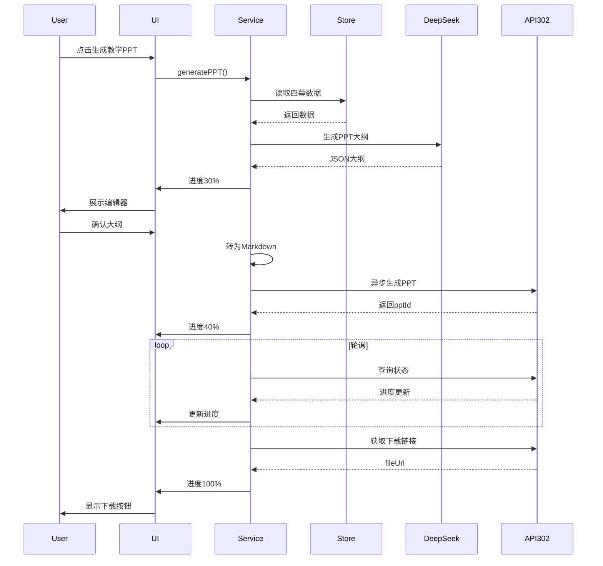
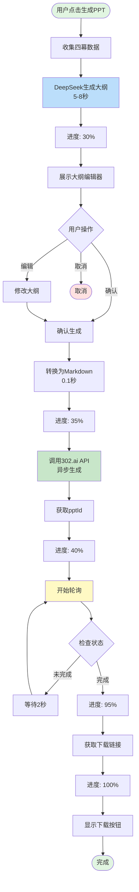
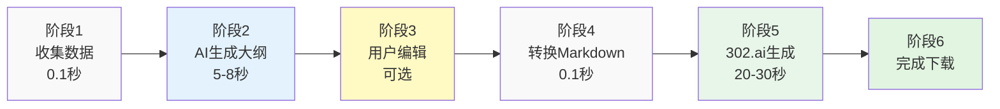

# PPT生成流程图

## 方式1：简化版序列图（兼容性最好）



---

## 方式2：流程图版本（更清晰）



---

## 方式3：阶段图版本（最简洁）



---

## 详细步骤说明

### 阶段1：数据收集（< 0.1秒）
```javascript
const data = {
  caseInfo: store.uploadData.extractedElements,      // 第一幕
  analysisResult: store.analysisData.result,         // 第二幕
  socraticLevel: store.socraticData.level,           // 第三幕
  learningReport: store.summaryData.caseLearningReport // 第四幕
};
```

### 阶段2：DeepSeek生成大纲（5-8秒）
```javascript
const outline = await callUnifiedAI(systemPrompt, userPrompt);
// 返回：{ slides: [...], metadata: {...} }
```

### 阶段3：用户编辑（可选）
- 修改标题和内容
- 添加/删除页面
- 调整顺序

### 阶段4：转换为Markdown（< 0.1秒）
```markdown
# 封面
内容...

## 第一页
内容...
```

### 阶段5：302.ai异步生成（20-30秒）
```javascript
// 1. 调用生成API
POST /302/ppt/generatecontent
// 2. 获取pptId
// 3. 轮询状态
GET /302/ppt/asyncpptinfo?pptId=xxx
// 4. 完成后获取下载链接
```

### 阶段6：完成
- 显示下载按钮
- 用户点击下载PPT文件

---

## 时间轴（总计35-40秒）

```
0秒  ━━ 点击生成
1秒  ━━ 数据收集完成
8秒  ━━ AI大纲生成完成 (进度30%)
10秒 ━━ 用户确认大纲
11秒 ━━ Markdown转换完成
12秒 ━━ 开始调用302.ai
15秒 ━━ 获取pptId，开始轮询 (进度40%)
25秒 ━━ 渲染进度50% (进度70%)
35秒 ━━ 渲染完成 (进度95%)
38秒 ━━ 获取下载链接 (进度100%)
40秒 ━━ 显示下载按钮
```

---

## 进度映射

| 阶段 | 时间 | 进度 | 消息 |
|------|------|------|------|
| 初始化 | 0-1秒 | 10% | 正在初始化... |
| AI生成大纲 | 1-8秒 | 10-30% | AI正在分析教学数据... |
| 用户编辑 | 8-10秒 | 30% | 请确认大纲 |
| 转换Markdown | 10-11秒 | 35% | 准备生成PPT... |
| 开始生成 | 11-15秒 | 35-40% | 开始生成PPT内容... |
| 渲染中 | 15-35秒 | 40-95% | 渲染中 3/6 页... |
| 获取链接 | 35-38秒 | 95-100% | 获取下载链接... |
| 完成 | 38秒+ | 100% | PPT生成完成！ |
