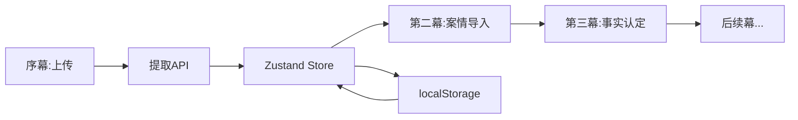

# 🎯 墨匠工作规划 - Phase 4: 事实认定与案情导入模块实现
**时间**: 2025-08-25  
**项目**: 法律教育平台 - Issues #3 & #4 实现  
**架构师**: 墨匠

## 📋 需求分析

### Issue #3: 事实认定教学模块MVP功能
**GitHub**: https://github.com/yejunhao159/law-education-platform-z1/issues/3

#### 核心需求
1. **时间轴事实展示** ⭐️ P0
   - 按时间顺序可视化事实
   - 支持横向/纵向滚动
   - 每个时间点显示关键事件摘要
   - 课堂投影友好的响应式设计

2. **争议事实标记系统** ⭐️ P0
   - 颜色标记事实分类
     - 🟢 双方认可的事实
     - 🟡 部分争议的事实  
     - 🔴 核心争议事实
   - 支持手动调整事实类型

3. **证据支撑可视化** ⭐️ P1
   - 争议事实的证据卡片展示
   - 证据类型标记（📄书证、👥证言、🔍物证、💻电子证据）
   - 证据强度标记
   - 拖拽关联证据与事实

4. **对比分析工具** ⭐️ P1
   - 并排展示双方陈述
   - 证据对比
   - 差异高亮
   - 教师批注功能

### Issue #4: 案情导入模块 - 第二幕技术方案
**GitHub**: https://github.com/yejunhao159/law-education-platform-z1/issues/4

#### 核心需求（P0优先级）
1. **修复上传bug** ✅ 已完成
2. **全局Context状态管理**
3. **数据流转机制**
4. **基础编辑功能**

#### 设计概念（P1优先级）
- **故事模式**：叙事化案情展示
- **视觉时间轴**：交互式进度
- **AI助手**：引导式探索

## 🏗️ 技术架构设计

### 1. 状态管理架构（Zustand）

```typescript
// lib/stores/useCaseStore.ts
interface CaseStore {
  // 核心数据
  caseData: LegalCase | null
  currentAct: string
  
  // 事实认定状态
  factDisputes: Map<string, 'agreed' | 'partial' | 'disputed'>
  evidenceLinks: Map<string, string[]>
  annotations: Map<string, string>
  
  // 案情导入状态
  storyMode: boolean
  editingFields: Set<string>
  
  // Actions
  setCaseData: (data: LegalCase) => void
  setCurrentAct: (act: string) => void
  markFactDispute: (factId: string, level: DisputeLevel) => void
  linkEvidence: (factId: string, evidenceId: string) => void
  addAnnotation: (id: string, text: string) => void
  toggleStoryMode: () => void
}
```

### 2. 组件架构

```
components/
├── acts/                         # 各幕组件
│   ├── Act2CaseIntro/           # 案情导入（Issue #4）
│   │   ├── index.tsx            # 主组件
│   │   ├── StoryView.tsx        # 故事视图
│   │   ├── DataFlow.tsx         # 数据流转
│   │   └── QuickEdit.tsx        # 快速编辑
│   │
│   └── Act3FactDetermination/   # 事实认定（Issue #3）
│       ├── index.tsx            # 主组件
│       ├── Timeline.tsx         # 时间轴
│       ├── DisputeMarker.tsx    # 争议标记
│       ├── EvidenceLinker.tsx   # 证据关联
│       └── Comparison.tsx       # 对比分析
│
└── shared/                      # 共享组件
    ├── TimelineBase.tsx         # 时间轴基础组件
    ├── EvidenceCard.tsx         # 证据卡片
    └── DisputeBadge.tsx         # 争议标记徽章
```

### 3. 数据流设计



## 📝 实施计划

### Phase 1: 基础设施（1小时）

#### 1.1 安装依赖
```bash
npm install zustand immer
npm install @dnd-kit/sortable @dnd-kit/core  # 可选，用于拖拽
```

#### 1.2 创建Store
- [ ] 创建 `lib/stores/useCaseStore.ts`
- [ ] 实现基础state和actions
- [ ] 添加localStorage持久化

#### 1.3 数据模型优化
- [ ] 扩展 `types/legal-case.ts`
- [ ] 添加争议标记接口
- [ ] 添加故事模式接口

### Phase 2: 案情导入模块（Issue #4）- 1.5小时

#### 2.1 全局Context集成（30分钟）
- [ ] 修改 `ThreeElementsExtractor.tsx` 添加数据回调
- [ ] 在提取成功后更新Store
- [ ] 自动跳转到第二幕

#### 2.2 故事模式实现（30分钟）
- [ ] 创建 `Act2CaseIntro/StoryView.tsx`
- [ ] 将事实转化为叙事段落
- [ ] 支持章节式展示

#### 2.3 数据编辑功能（30分钟）
- [ ] 创建 `Act2CaseIntro/QuickEdit.tsx`
- [ ] 支持内联编辑
- [ ] 实时保存到Store

### Phase 3: 事实认定模块（Issue #3）- 2小时

#### 3.1 时间轴组件（45分钟）
- [ ] 创建 `Act3FactDetermination/Timeline.tsx`
- [ ] 实现垂直/水平布局切换
- [ ] 响应式设计适配投影

#### 3.2 争议标记系统（30分钟）
- [ ] 创建 `Act3FactDetermination/DisputeMarker.tsx`
- [ ] 三色标记系统
- [ ] 点击切换状态

#### 3.3 证据关联（30分钟）
- [ ] 创建 `Act3FactDetermination/EvidenceLinker.tsx`
- [ ] 证据卡片展示
- [ ] 简单点击关联（MVP版本不做拖拽）

#### 3.4 对比分析（15分钟）
- [ ] 创建 `Act3FactDetermination/Comparison.tsx`
- [ ] 双栏对比布局
- [ ] 差异高亮显示

### Phase 4: 集成测试（30分钟）
- [ ] 数据流测试
- [ ] 状态持久化测试
- [ ] 响应式布局测试
- [ ] 性能优化

## 🎯 技术决策

### 选择Zustand的理由
1. **轻量级**: 仅4KB，对比Redux的10KB+
2. **简洁API**: 无需Provider嵌套
3. **TypeScript友好**: 完美的类型推导
4. **性能优秀**: 自动优化重渲染

### MVP简化策略
1. **暂不实现拖拽**: 用点击代替，降低复杂度
2. **简化动画**: 仅保留必要的过渡效果
3. **延后AI功能**: 先实现基础功能，AI增强后续迭代

### 性能优化方案
1. **虚拟滚动**: 长时间轴使用react-window
2. **懒加载**: 证据卡片按需加载
3. **防抖保存**: 编辑时500ms防抖

## 🚀 预期成果

### 用户体验提升
- ✅ 流畅的数据流转，无需手动传递
- ✅ 直观的争议标记，一目了然
- ✅ 灵活的编辑模式，随时修改
- ✅ 清晰的时间脉络，易于理解

### 技术架构改进
- ✅ 统一的状态管理，易于维护
- ✅ 模块化组件设计，便于扩展
- ✅ 类型安全保障，减少bug
- ✅ 性能优化到位，响应迅速

## ⏰ 时间安排

**总时长**: 5小时

| 阶段 | 任务 | 时长 | 完成标志 |
|------|------|------|----------|
| 基础 | 依赖+Store | 1h | Store可用 |
| 案情 | Issue #4实现 | 1.5h | 数据流通 |
| 事实 | Issue #3实现 | 2h | 功能完整 |
| 测试 | 集成测试 | 0.5h | 无bug |

## 🔍 风险控制

### 技术风险
- **风险**: Zustand与现有代码冲突
- **缓解**: 渐进式迁移，保留原有state作为备份

### 时间风险
- **风险**: 功能过多导致延期
- **缓解**: 严格按P0/P1优先级执行

### 质量风险
- **风险**: 匆忙实现导致bug
- **缓解**: 每个模块完成后立即测试

---
**墨匠 - 精准实现，高效交付** 🎯  
*让法律教育技术化，让技术服务教育*